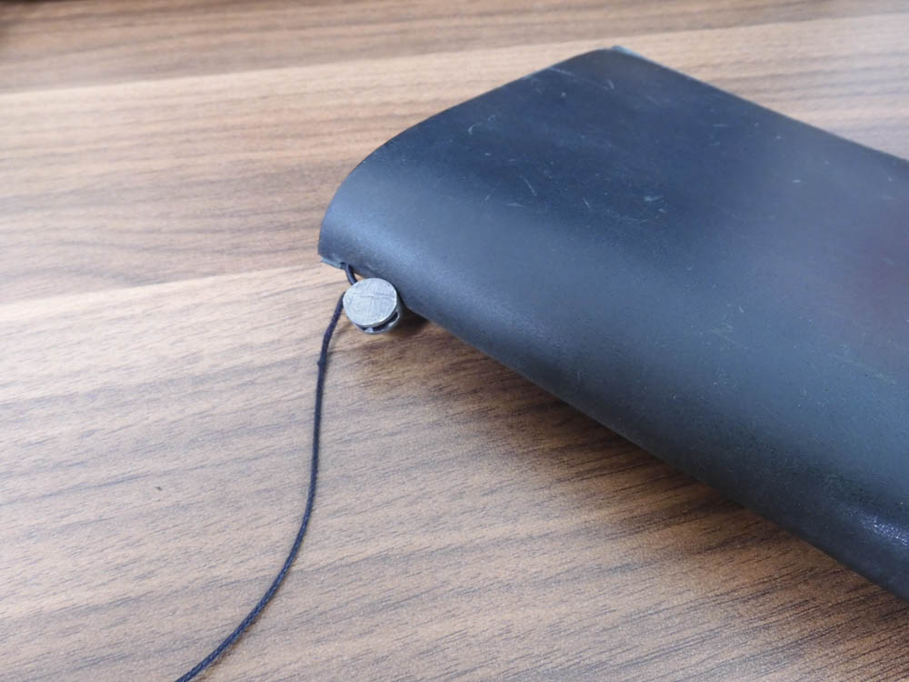
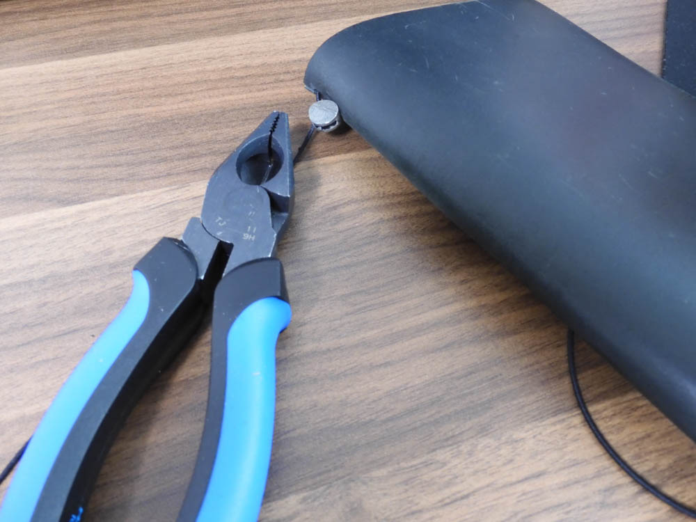
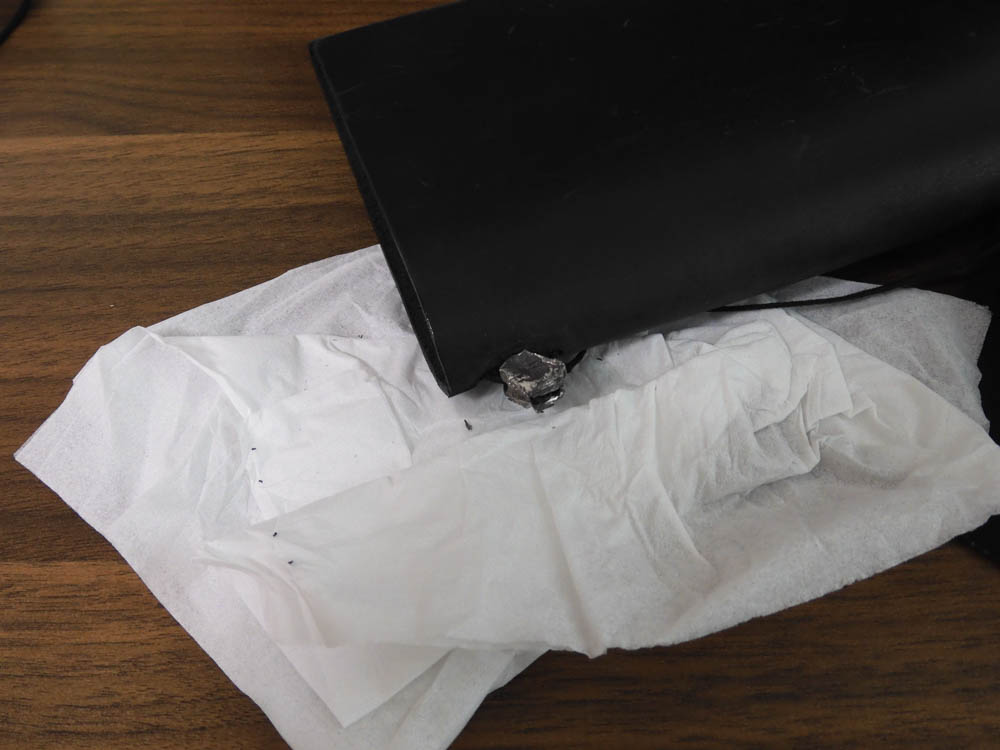
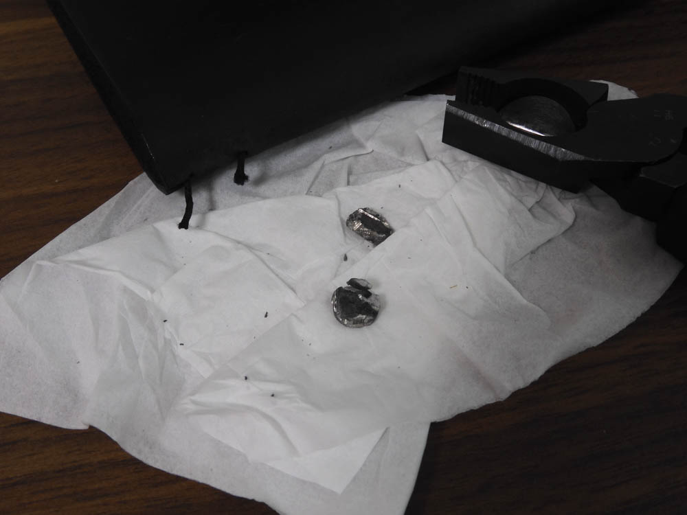
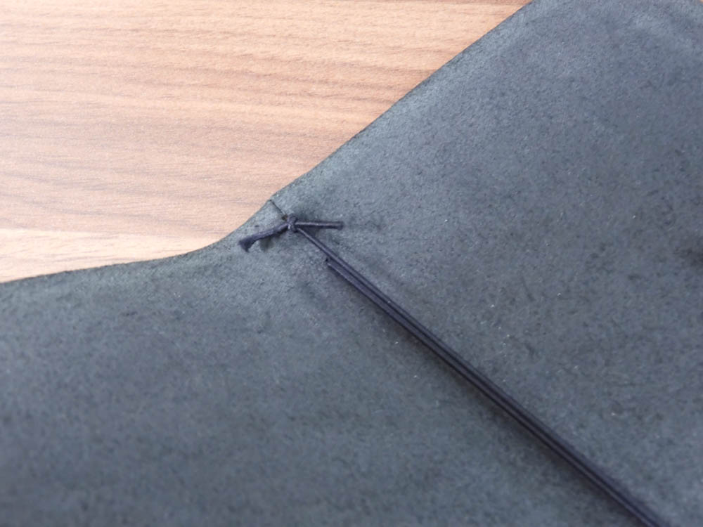
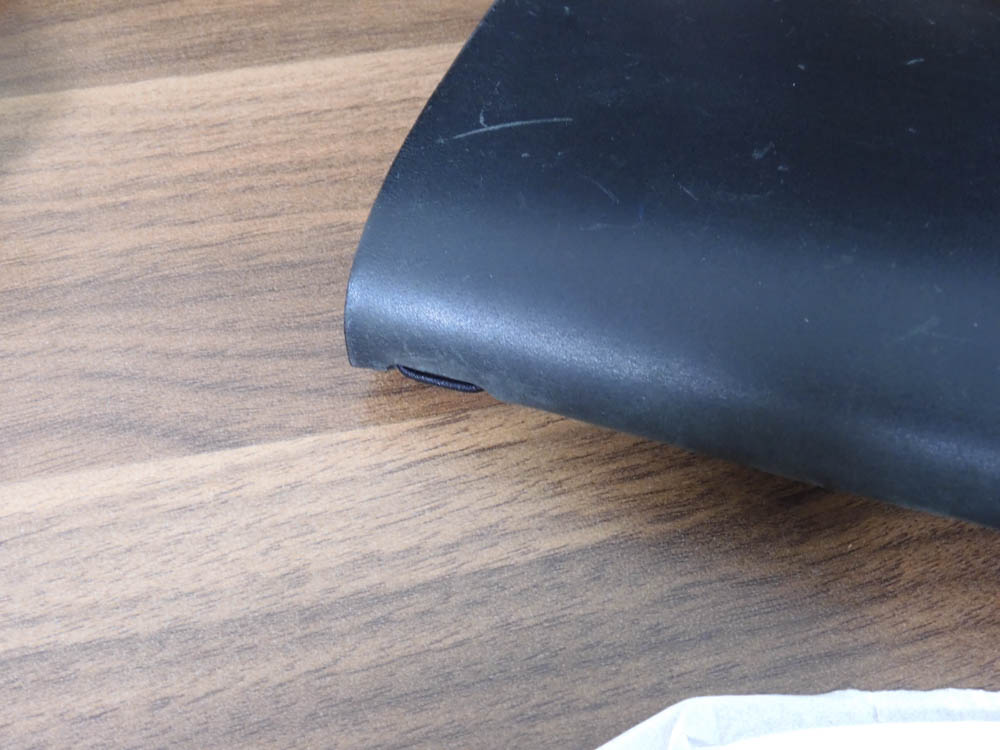
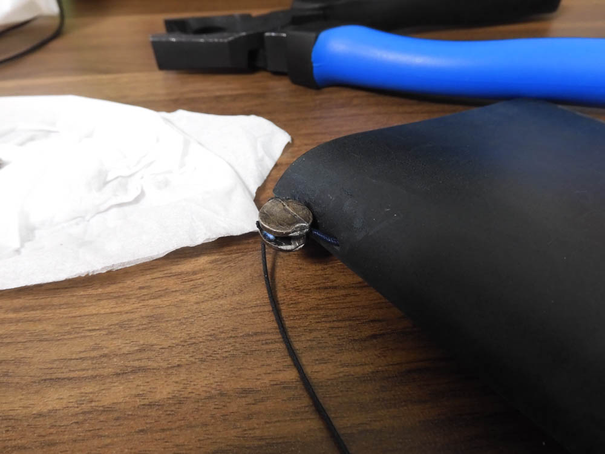
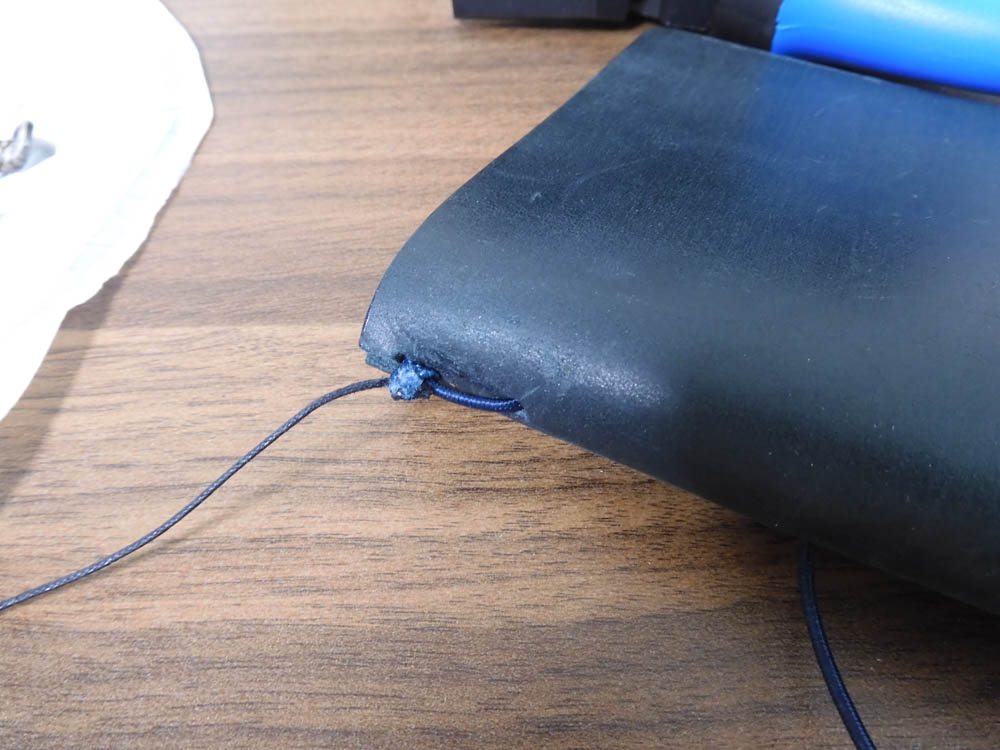

邪魔で邪魔でしょうがなかったあの金具を外した。  

<!--more-->

トラベラーズノートの唯一で最大の欠点はあの金具。  

書くたびに机が傷つかないかとヒヤヒヤしたが今回やっと取ることに成功した。絶対設計ミスだよあの金具。  
- - - 

この金具を取り外していきます。  
  

100円ショップのペンチじゃ全く歯が立たなかったのでハンズでペンチを購入。2300円なり。かなりの痛手だ。  
  

最初は押しつぶしてやろうと思ったけどかなり手強い。  
  

あまり使いたくなかったけどニッパー部分で切ることに。ニッパーを使うと意外と柔らかかった。  
  

結び目を後ろに回してやって、  
  

完成！スッキリした！
  

もうひとつのトラベラーズノートも金具をはずていきます。 ペンチで握りつぶさずに上手く隙間にニッパーの歯を入れるのがコツなのだと思った。ただひもまで切れそうで怖い。  
  

金具を取ったら結び目がでてきた。かなり雑な結び方だ。この結び目を隠すための金具だったようですね。
  

