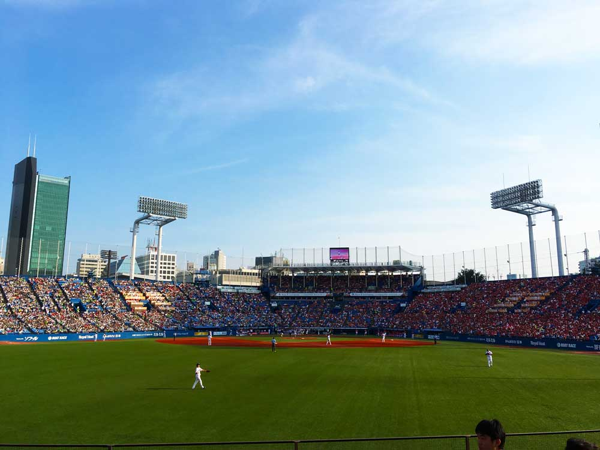

今まで行ってきた野球観戦をまとめています。

<!--more-->

- - - 

## 2017年
### 2017年7月7日 (金)
#### 公式戦 in 神宮
#### 広島 9 対 ヤクルト 8
記念すべき初めての神宮観戦。最後はまさかの9回裏新井の逆転ホームラン。七夕の季節になると今でも思い出す試合です。
友人Kと行った試合です。とてもよかった！！
  

- - -

### 2017年7月9日 (日)
#### オープン戦 in 神宮
#### 広島 3 対 ヤクルト 3
この日は奥さんと観戦。９回までカープが負けていたが新井のタイムリーで同点へ。そのまま逆転かと思ったが結局は引き分けだった。
この日は自由席だったため２時間前から並んだ。延長戦は少ししんどかったな。
  

- - -

### 2017年9月2日 (土)
#### 公式戦 in 神宮
#### 広島 3 対 ヤクルト 1
この日は一人で参戦。今はなきチケットキャンプでチケットを購入。初めての内野席だった。
隣のオヤジがうるさいし、席を変わって欲しいと頼まれたりで良い席ではなかった(変わった直後に後ろのオヤジの野次がひどいので再度代わってもらった。席の交換はこりごりだ。)。
内野席の後ろの方は音楽がうるさいなと思った。
ただ、内野席から見る外野はキレイだった。半分が赤、半分が緑でよいバランスだったな。
  

- - -

