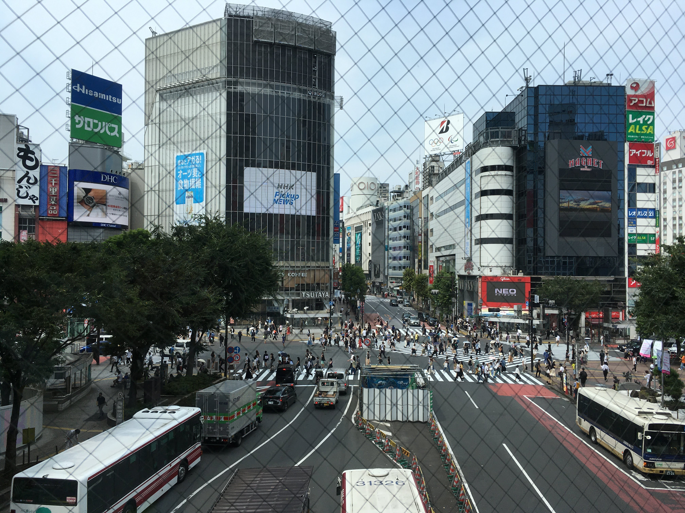
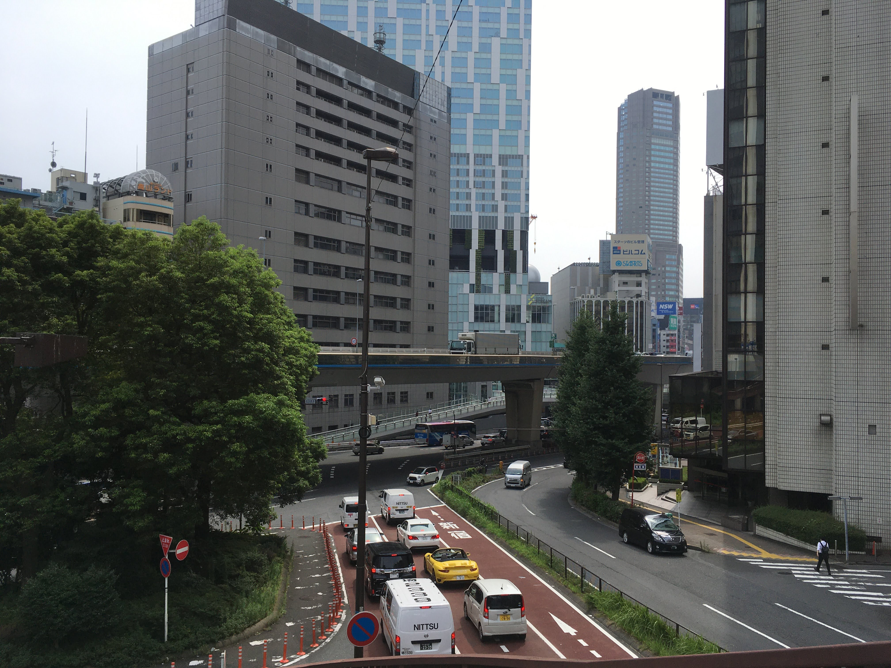
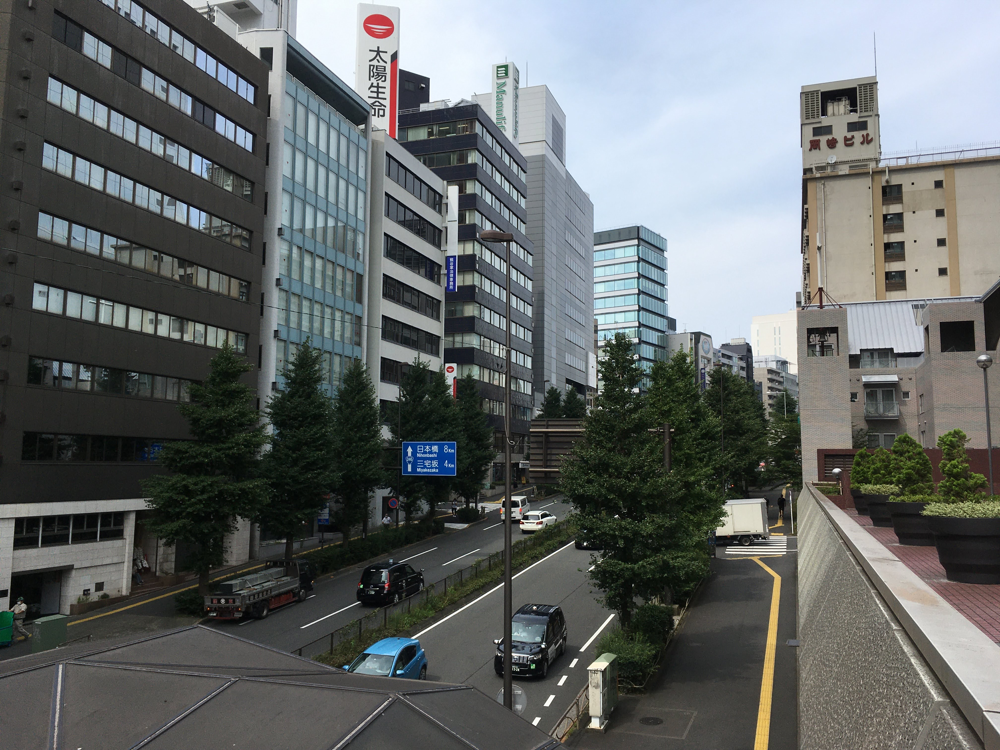

3/27から始まった在宅ワークから133日ぶりに出社します。  
<!--more-->

とはいっても在宅ワークはまだまだ続きます。会社が一部のビルをクローズするために引っ越し作業に行くだけ。
いつまでこのコロナ騒動は続くんだろう。外は晴れていて外出するには良いけど暑すぎる。今年一番の暑さじゃないのかというくらい暑いです。  

最近の東京の暑さはハワイや沖縄を思い出すくらいの南国の暑さに似ています。これが温暖化なのでしょうか。とにかく暑い。日焼け止めが手放せない。  
はやく秋にならないものでしょうか。  

コロナは相変わらず蔓延していますが渋谷は結構な人でした。
  

会社の近く
  

人も車も平常運転かな。
  

自粛期間中に食べた物たち。自粛開始は桜の季節だったけどもうスイカの季節。
  

天ぷらも食べた。うまい！
  