3/27から始まった在宅ワークから172日が経過。当時想定していたよりも長くなってしまいました。  
<!--more-->

在宅ワークの当初は不便さややりずらさもあったのですが、今はすっかりなれてしまいました。会社通勤しないことに慣れてしまったのでその逆は少し怖いです。  
さて、最近のことを書いていきます。  

今年は買わないと思っていたけど買ってしまいました。羽月くんの初スタメン初ヒロインのTシャツ。  
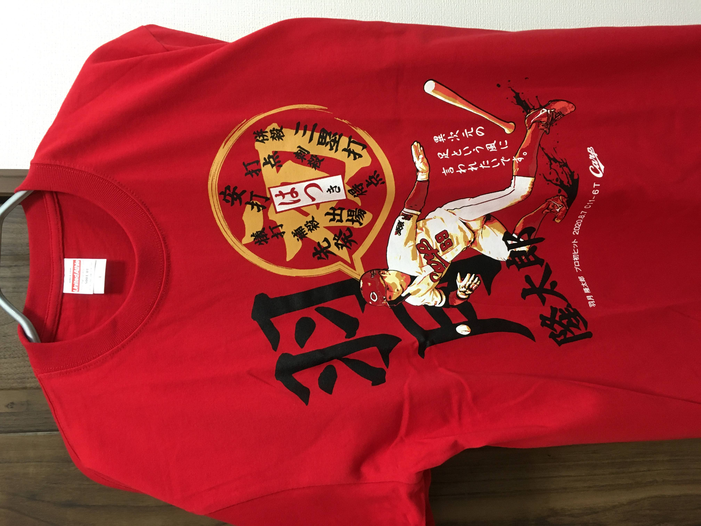  

カープも弱くなってきたのでグッズも値下げが始まったのか。  
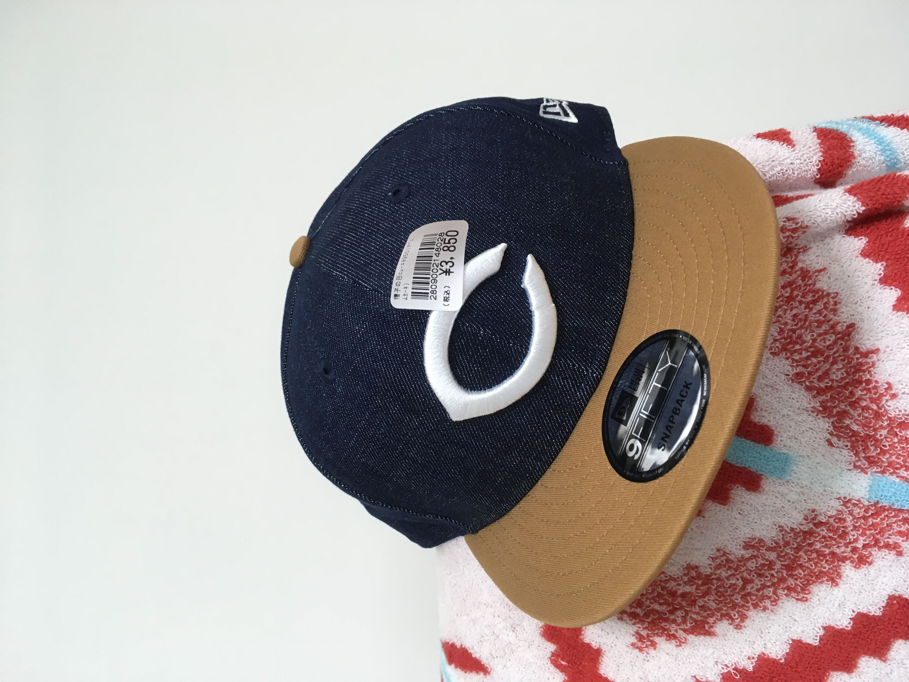  

安定の美味しさ。  
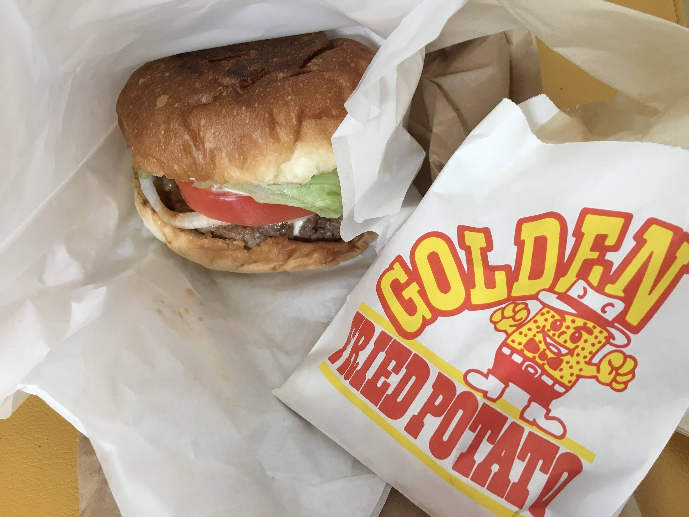  

名古屋土産。  
  

パッケージがいい。  
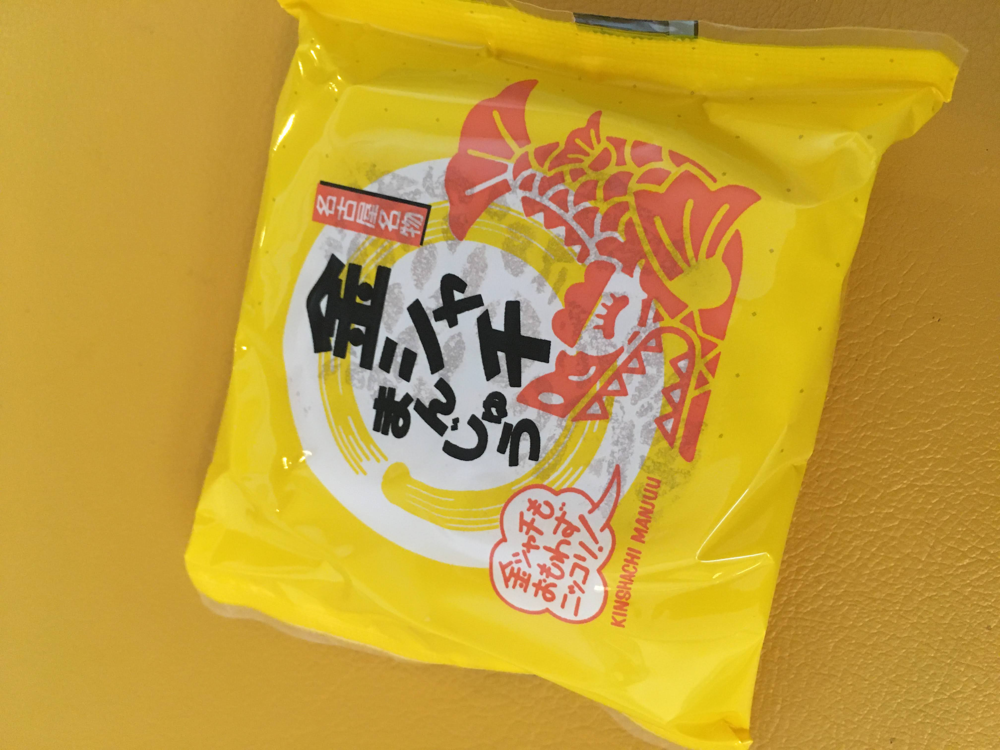  

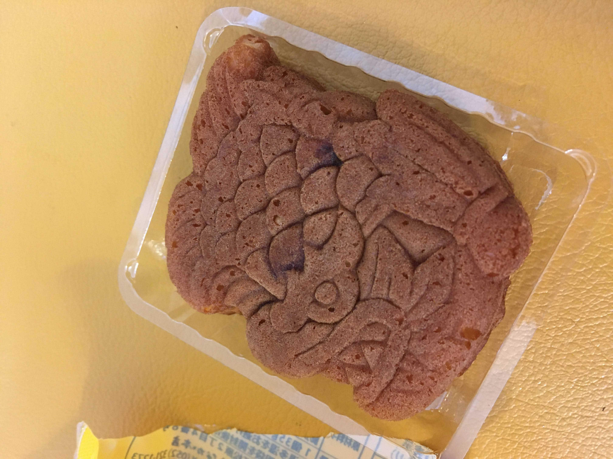  

これでサラダがついて500円。  
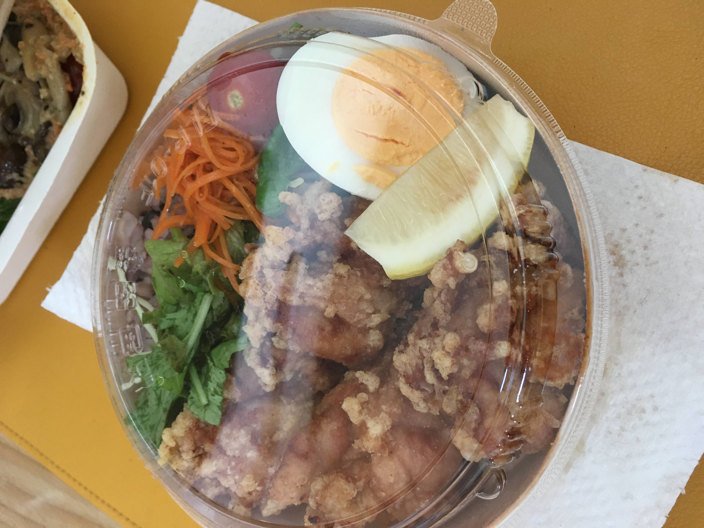  
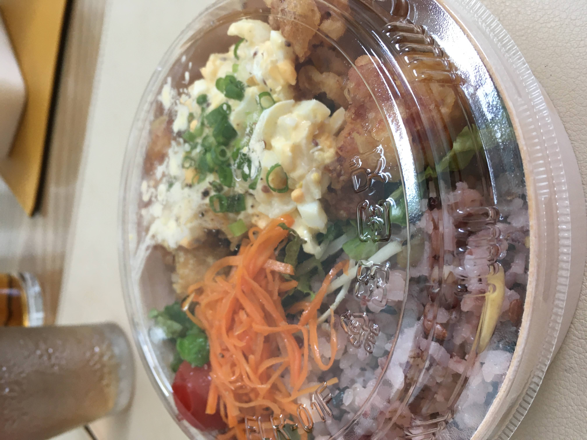  

きしだなおき氏の本が出てので購入。Javaなのにすごくワクワクする内容ばかり。  
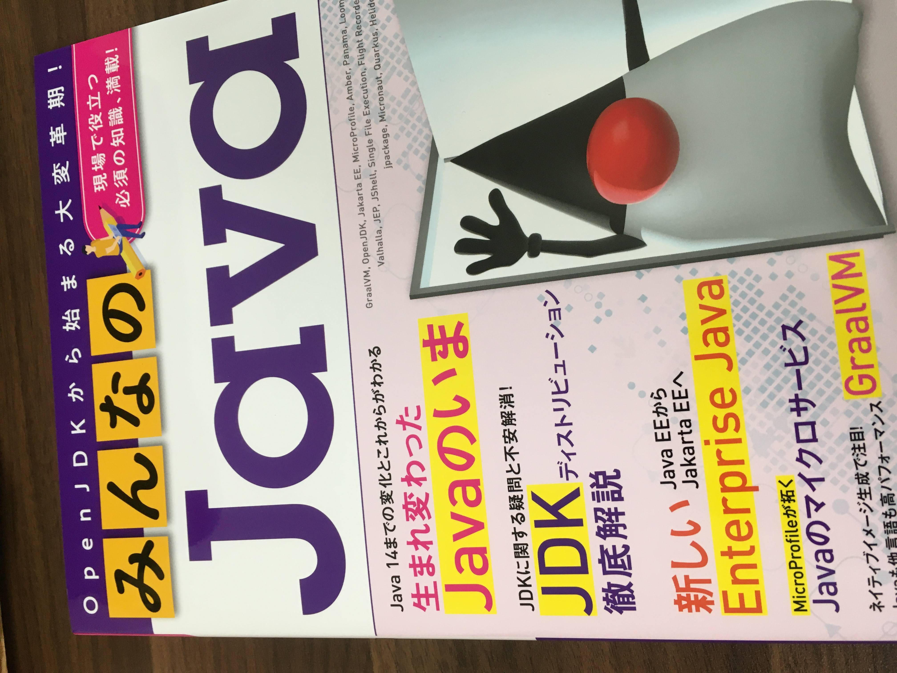  

実家に送ったふぐセット。8000円  
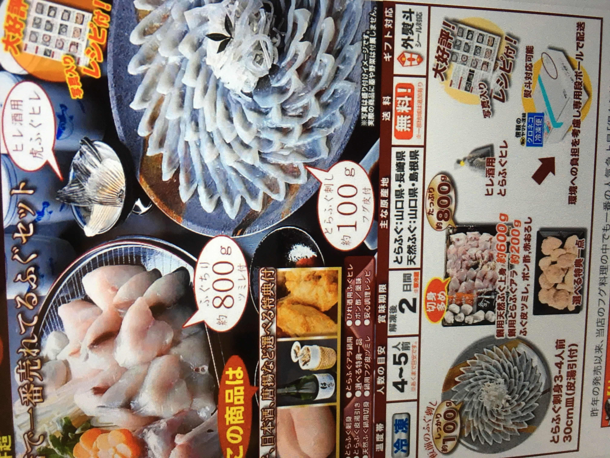  

ハニカム構造。おしりの痛いのが治った。  
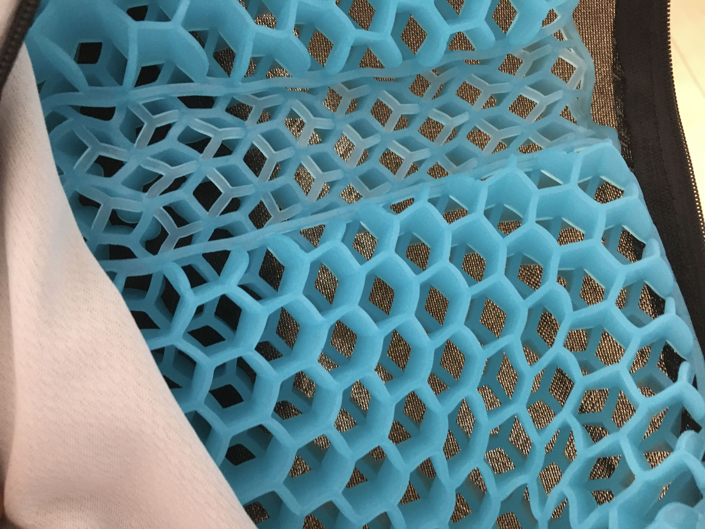  

カバーをつけるとこんな感じ
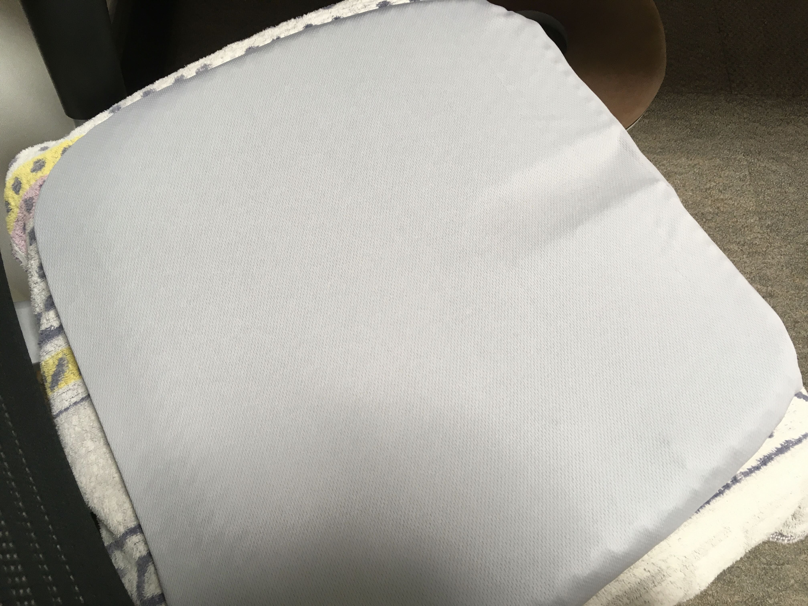  