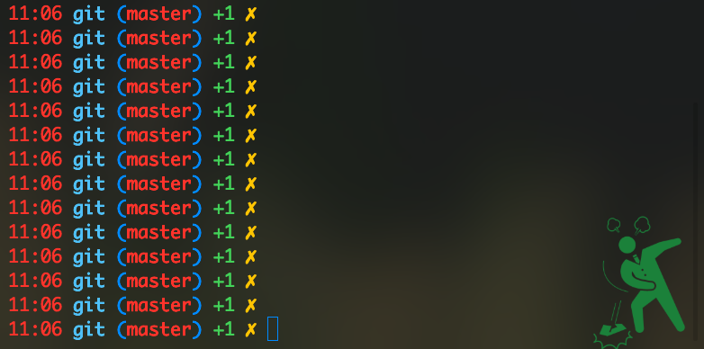

ここ2年くらい愛用しているコンソールディタ[Hyper](https://hyper.is/)の自分用設定ファイル例です。このコンソールの最大の特徴は設定ファイルがJavascript構文に従ってかけるということです。  
<!--more-->

こんな感じのコンソールです。右下に好きな画像を好きな大きさで表示させることができます。  
  

## 設定ファイルの設置方法
`.hyper.js` というファイルを作って、`/User/ユーザ名`直下に設置します。（すでにファイルがあれば以下の内容で上書きます。)  
こちらのファイルに後続で紹介するJavascript内容を貼り付ければ設定は完了です。  

## 画像の設置方法
`background-image` にローカルに設置した画像を指定すると画面右下に画像が表示されます。  
```javascript
.terms_terms{
  // Please change the below path!
  // You can specify the image path to show bottom of terminal.
  background-image:url("file:///Users/XXX/test.png");
  background-size: 20%;
  background-position: right bottom;
  background-repeat: no-repeat;
}
 ```


## .hyper.js の内容
以下内容をコピーして`.hyper.js`に貼り付けて下さい。これで設定は完了です。  
```javascript
// Future versions of Hyper may add additional config options,
// which will not automatically be merged into this file.
// See https://hyper.is#cfg for all currently supported options.

module.exports = {
  config: {
    // choose either `'stable'` for receiving highly polished,
    // or `'canary'` for less polished but more frequent updates
    updateChannel: 'stable',

    // default font size in pixels for all tabs
    fontSize: 18,

    // font family with optional fallbacks
    fontFamily: 'Menlo, "DejaVu Sans Mono", Consolas, "Lucida Console", monospace',

    // default font weight: 'normal' or 'bold'
    fontWeight: 'normal',

    // font weight for bold characters: 'normal' or 'bold'
    fontWeightBold: 'bold',

    // line height as a relative unit
    lineHeight: 1,

    // letter spacing as a relative unit
    letterSpacing: 0,

    // terminal cursor background color and opacity (hex, rgb, hsl, hsv, hwb or cmyk)
    cursorColor: 'rgba(248,28,229,0.7)',

    // terminal text color under BLOCK cursor
    cursorAccentColor: '#000',

    // `'BEAM'` for |, `'UNDERLINE'` for _, `'BLOCK'` for █
    cursorShape: 'BLOCK',

    // set to `true` (without backticks and without quotes) for blinking cursor
    cursorBlink: false,

    // color of the text
    foregroundColor: '#fff',

    // terminal background color
    // opacity is only supported on macOS
    //backgroundColor: 'rgba(226,38,58,0.7)',
    //backgroundColor: 'rgba(57,57,57,0.9)',

    // terminal selection color
    selectionColor: 'rgba(248,28,229,0.3)',

    // border color (window, tabs)
    borderColor: '#333',

    // custom CSS to embed in the main window
    css: `
    .terms_terms{
      // Please change the below path!
      // You can specify the image path to show bottom of terminal.
      background-image:url("file:///Users/XXX/test.png");
      background-size: 20%;
      background-position: right bottom;
      background-repeat: no-repeat;
    };
    `,


    // custom CSS to embed in the terminal window
    termCSS: '',

    // if you're using a Linux setup which show native menus, set to false
    // default: `true` on Linux, `true` on Windows, ignored on macOS
    showHamburgerMenu: '',

    // set to `false` (without backticks and without quotes) if you want to hide the minimize, maximize and close buttons
    // additionally, set to `'left'` if you want them on the left, like in Ubuntu
    // default: `true` (without backticks and without quotes) on Windows and Linux, ignored on macOS
    showWindowControls: '',

    // custom padding (CSS format, i.e.: `top right bottom left`)
    padding: '12px 14px',

    // the full list. if you're going to provide the full color palette,
    // including the 6 x 6 color cubes and the grayscale map, just provide
    // an array here instead of a color map object
    colors: {
      black: '#000000',
      red: '#C51E14',
      green: '#1DC121',
      yellow: '#C7C329',
      blue: '#0A2FC4',
      magenta: '#C839C5',
      cyan: '#20C5C6',
      white: '#C7C7C7',
      lightBlack: '#686868',
      lightRed: '#FD6F6B',
      lightGreen: '#67F86F',
      lightYellow: '#FFFA72',
      lightBlue: '#6A76FB',
      lightMagenta: '#FD7CFC',
      lightCyan: '#68FDFE',
      lightWhite: '#FFFFFF',
    },

    // MaterialTheme: {
        // Set the theme variant,
        // OPTIONS: 'Darker', 'Palenight', 'Ocean', ''
        // theme: '',

        // [Optional] Set the rgba() app background opacity, useful when enableVibrance is true
        // OPTIONS: From 0.1 to 1
        // backgroundOpacity: '0.9',

        // [Optional] Set the accent color for the current active tab
        // accentColor: '#64FFDA',

        // [Optional] Mac Only. Need restart. Enable the vibrance and blurred background
        // OPTIONS: 'dark', 'ultra-dark', 'bright'
        // NOTE: The backgroundOpacity should be between 0.1 and 0.9 to see the effect.
        // vibrancy: 'dark'
    // },
    verminal: {
      fontSize: 20
    },
    // the shell to run when spawning a new session (i.e. /usr/local/bin/fish)
    // if left empty, your system's login shell will be used by default
    //
    // Windows
    // - Make sure to use a full path if the binary name doesn't work
    // - Remove `--login` in shellArgs
    //
    // Bash on Windows
    // - Example: `C:\\Windows\\System32\\bash.exe`
    //
    // PowerShell on Windows
    // - Example: `C:\\WINDOWS\\System32\\WindowsPowerShell\\v1.0\\powershell.exe`
    shell: '',

    // for setting shell arguments (i.e. for using interactive shellArgs: `['-i']`)
    // by default `['--login']` will be used
    shellArgs: ['--login'],

    // for environment variables
    env: {},

    // set to `false` for no bell
    bell: 'SOUND',

    // if `true` (without backticks and without quotes), selected text will automatically be copied to the clipboard
    copyOnSelect: false,

    // if `true` (without backticks and without quotes), hyper will be set as the default protocol client for SSH
    defaultSSHApp: true,

    // if `true` (without backticks and without quotes), on right click selected text will be copied or pasted if no
    // selection is present (`true` by default on Windows and disables the context menu feature)
    quickEdit: true,

    // URL to custom bell
    // bellSoundURL: 'http://example.com/bell.mp3',

    // for advanced config flags please refer to https://hyper.is/#cfg
  },

  // a list of plugins to fetch and install from npm
  // format: [@org/]project[#version]
  // examples:
  //   `hyperpower`
  //   `@company/project`
  //   `project#1.0.1`
  // plugins: ['hyper-material-theme'],
  plugins: ['verminal', 'hyper-search'],

  // in development, you can create a directory under
  // `~/.hyper_plugins/local/` and include it here
  // to load it and avoid it being `npm install`ed
  localPlugins: [],

  keymaps: {
    // Example
    // 'window:devtools': 'cmd+alt+o',
  },
};
```

