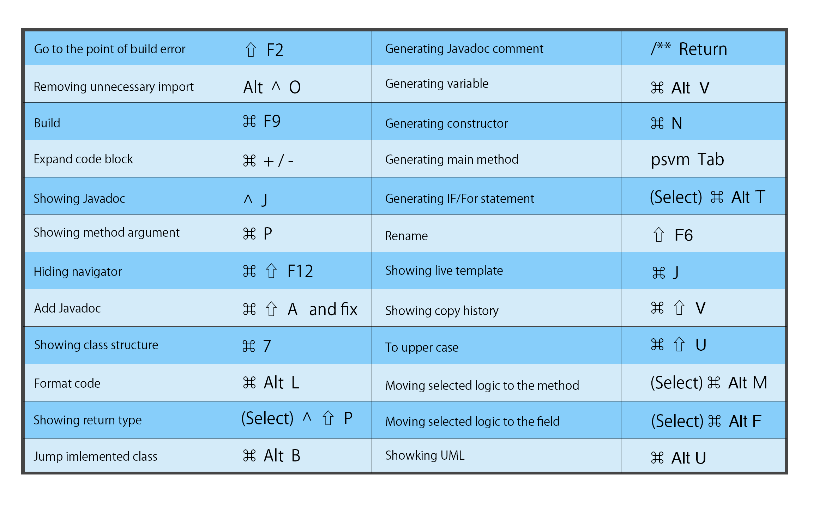

ここ2年くらい愛用しているコンソールディタ[Hyper](https://hyper.is/)の自分用設定ファイル例です。このコンソールの最大の特徴は設定ファイルがJavascript構文に従ってかけるということです。  
<!--more-->

## Key Map for Jump

| Description                | Key Map                                     |
| -------------------------- | ------------------------------------------- |
| 前の位置に戻る & 進む               | `Option` + `Command` + `→←`                 |
| 選択したメソッドへ移動                | `Command` + `B`                             |
| 最近開いたファイルを開く               | `Command` + `E`                                 |
| 開いているファイルへナビゲーション上移動する    | `Option` + `F1`                                 |
| ビルドエラー箇所に移動                | `Shift` + `F2`                                  |
| 選択している変数が使わている箇所全てへフォーカスする | `Ctrl` + `G`                                    |
| 子クラスへ移動                    | `Command` + `U`                                 |
| インターフェースから実クラスへ移動          | `Option` + `Command` + `B`                        |
| クラスやナビゲーションを移動             | `Ctrl` + `Tab` (Should be set to "Shift + Tab") |

## Key Map for Edit

| Description                                           | Key Map                                                         |
| ----------------------------------------------------- | --------------------------------------------------------------- |
| Quick-fixes. (Adding package into the import syntax.) | Option + Return                                                 |
| Removing unnecessary import                           | Option + Ctrl + O                                               |
| Align code format                                     | Option + Command + L                                            |
| Close tab                                             | Command + W                                                     |
| Build                                                 | Command + F9                                                    |
| Copy Line                                             | Command + D                                                     |
| Delete Line                                           | Command + Del                                                   |
| Add new Line                                          | Shift + Enter                                                   |
| Focus expand                                          | Option + ↑                                                      |
| Focus reduce                                          | Option + ↓                                                      |
| Moving forcused line                                  | Option + Shift + ↑/↓                                            |
| Forcus Editor                                         | esc                                                             |
| Moving line like mouse while                          | fn + ↑/↓(page up/down)                                          |
| Go to start of line                                   | Ctrl + a                                                        |
| Go to end of line                                     | Ctrl + e                                                        |
| Go to specified line                                  | Command + L                                                     |
| Go to variable                                        | Option + Command + F7                                           |
| Show where variable is used                           | Option + F7                                                     |
| Expand code block                                     | Command + .                                                     |
| Showing Javadoc                                       | Ctrl + J                                                        |
| Showing method argument                               | Command + P                                                     |
| Hiding navigator                                      | Command + Shift + F12                                           |
| Add Javadoc                                           | Command + Shift + A then put "fix "                             |
| Close other                                           | It is necessary to set on keymap. I set like this. `Option + W` |

## Key Map for Generate

| Description                 | Key Map                      |
| --------------------------- | ---------------------------- |
| Generating Javadoc comment  | /** + return                 |
| Generating variable         | Option + Command + V         |
| Generating constructor      | Command + N                  |
| Generating class            | Command + N                  |
| Generating main method      | psvm + Tab                   |
| Generating IF/For statement | Command + Option + T         |
| Generating IF/For statement | Command + Option + T         |
| Generating UML              | Option + Shift + Command + U |

## Key Map for Showing information

| Description            | Key Map          |
| ---------------------- | ---------------- |
| Showing Callers method | Option +Ctrl + H |
| Showing list of method | Command + F12    |
| Showing extended class | Ctrl + H         |

## Key Map for Refactoring

|Description  |Key Map  |
|---|---|
|Move package| F6|
|Rename| Shift + F6|
|Open refactoring navigator| Ctrl + T|

## Key map for Debug

|Description  |Key Map  |
|---|---|
|Execute main method| Ctrl + Shift + R or D|
|Run junit| Ctrl + Shift + F10|
|Step over| F8|
|Step in| F7|
|Go to next break point| Option + F9|
|Set/Remove break point| Command + F8|

## Key map for Git

|Description  |Key Map  |
|---|---|
|Commit| Command + K|
|Push| Command + Shift + K|
|Pull| Command + T|
|Showing git command List| Ctrl + V|

  
