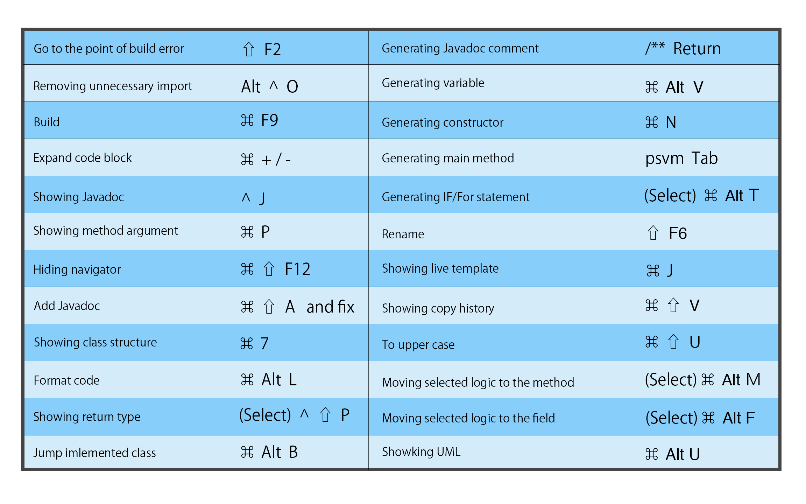

IntelliJでよく使うショートカットキーをまとめました。  
<!--more-->

## ナビゲータ系

| Description                          | Key Map       |
| ------------------------------------ | ------------- |
| Toggle SideBar                       | `⌘` `1`       |
| Focuse a opened file name in SideBar | `⌥` `F1`, `1` |

## IntelliJ内移動系

| Description                              | Key Map   |
| ---------------------------------------- | --------- |
| Toggle debuger of console.               | `⌘` `5`   |
| Switch forcuse between file and SideBar. | `⌃` `Tab` |

## ファイル内系

| Description              | Key Map  |
| ------------------------ | -------- |
| Move cursor to the issue line. | `⇧` `F2` |

## クラス（継承など）

| Description                                   | Key Map     |
| --------------------------------------------- | ----------- |
| Move to override method from original method. | `⌥` `⌘` `B` |
| Move to implemented class from Interface.     | `⌥` `⌘` `B` |
| Move to child class.                          | `⌘` `U`     |

## JUnit

| Description            | Key Map  |
| ---------------------- | -------- |
| Add/Remove break point | `⌘` `F8` |

## Key Map for Jump

| Description  | Key Map         |
| ------------ | --------------- |
| 選択したメソッドへ移動  | `Command` + `B` |
| 最近開いたファイルを開く | `Command` + `E` |

## Key Map for Edit

| Description                  | Key Map                             |
| ---------------------------- | ----------------------------------- |
| Quick-fixes.                 | Option + Return                     |
| Removing unnecessary import  | Option + Ctrl + O                   |
| Align code format            | Option + Command + L                |
| Close tab                    | Command + W                         |
| Build                        | Command + F9                        |
| Copy Line                    | Command + D                         |
| Delete Line                  | Command + Del                       |
| Add new Line                 | Shift + Enter                       |
| Focus expand                 | Option + ↑                          |
| Focus reduce                 | Option + ↓                          |
| Moving forcused line         | Option + Shift + ↑/↓                |
| Forcus Editor                | esc                                 |
| Moving line like mouse while | fn + ↑/↓(page up/down)              |
| Go to start of line          | Ctrl + a                            |
| Go to end of line            | Ctrl + e                            |
| Go to specified line         | Command + L                         |
| Go to variable               | Option + Command + F7               |
| Show where variable is used  | Option + F7                         |
| Expand code block            | Command + .                         |
| Showing Javadoc              | Ctrl + J                            |
| Showing method argument      | Command + P                         |
| Hiding navigator             | Command + Shift + F12               |
| Add Javadoc                  | Command + Shift + A then put "fix " |
| Close other                  | `Option + W`                        |

## Key Map for Generate

| Description                 | Key Map                      |
| --------------------------- | ---------------------------- |
| Generating Javadoc comment  | /** + return                 |
| Generating variable         | Option + Command + V         |
| Generating constructor      | Command + N                  |
| Generating class            | Command + N                  |
| Generating main method      | psvm + Tab                   |
| Generating IF/For statement | Command + Option + T         |
| Generating IF/For statement | Command + Option + T         |
| Generating UML              | Option + Shift + Command + U |

## Key Map for Showing information

| Description            | Key Map          |
| ---------------------- | ---------------- |
| Showing Callers method | Option +Ctrl + H |
| Showing list of method | Command + F12    |
| Showing extended class | Ctrl + H         |

## Key Map for Refactoring

| Description                | Key Map    |
| -------------------------- | ---------- |
| Move package               | F6         |
| Rename                     | Shift + F6 |
| Open refactoring navigator | Ctrl + T   |

## Key map for Debug

| Description            | Key Map               |
| ---------------------- | --------------------- |
| Execute main method    | Ctrl + Shift + R or D |
| Run junit              | Ctrl + Shift + F10    |
| Step over              | F8                    |
| Step in                | F7                    |
| Go to next break point | Option + F9           |
| Set/Remove break point | Command + F8          |

## Key map for Git

| Description              | Key Map             |
| ------------------------ | ------------------- |
| Commit                   | Command + K         |
| Push                     | Command + Shift + K |
| Pull                     | Command + T         |
| Showing git command List | Ctrl + V            |

  

## おすすめプラグインたち

| Description                  | Plugins            |
| ---------------------------- | ------------------ |
| Adding markdown preview.     | Markdown Navigator |
| Showing current branch name. | Git ToolBox        |
| Changing to material UI.     | Material Theme UI  |
| Changing brackets color.     | Rainbow Brackets   |
| Executing Maven commands.    | maven helper       |
| Using Lombok.                | Lombok Plugin      |
| Changing SQL Editor.         | SQL Query Plugin   |
| Changing console window      | Grep Console       |

