今まで行ってきた野球観戦をまとめています。

<!--more-->

- - - 

## 2017年
### 2017年7月7日 (金)
#### 公式戦 in 神宮
#### 広島 9 対 ヤクルト 8
記念すべき初めての神宮観戦。最後はまさかの9回裏新井の逆転ホームラン。七夕の季節になると今でも思い出す試合です。
友人Kと行った試合です。とてもよかった！！
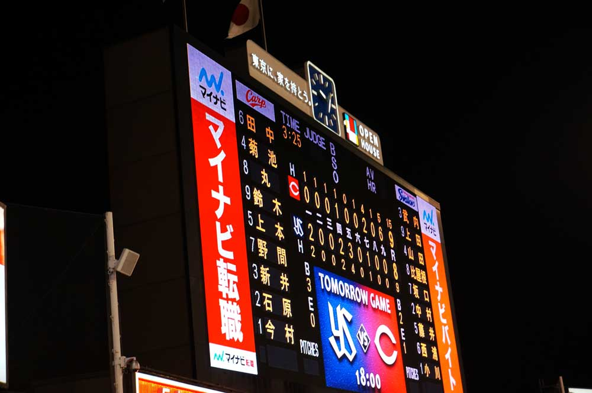  

- - -

### 2017年7月9日 (日)
#### オープン戦 in 神宮
#### 広島 3 対 ヤクルト 3
この日は奥さんと観戦。９回までカープが負けていたが新井のタイムリーで同点へ。そのまま逆転かと思ったが結局は引き分けだった。
この日は自由席だったため２時間前から並んだ。延長戦は少ししんどかったな。
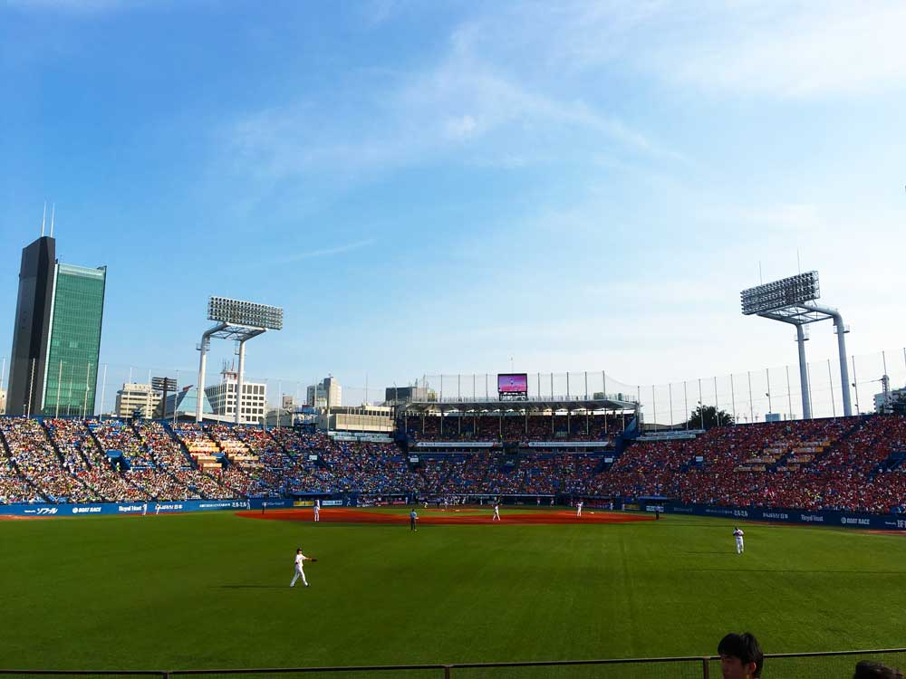  

- - -

### 2017年9月2日 (土)
#### 公式戦 in 神宮
#### 広島 3 対 ヤクルト 1
この日は一人で参戦。今はなきチケットキャンプでチケットを購入。初めての内野席だった。
隣のオヤジがうるさいし、席を変わって欲しいと頼まれたりで良い席ではなかった(変わった直後に後ろのオヤジの野次がひどいので再度代わってもらった。席の交換はこりごりだ。)。
内野席の後ろの方は音楽がうるさいなと思った。
ただ、内野席から見る外野はキレイだった。半分が赤、半分が緑でよいバランスだったな。
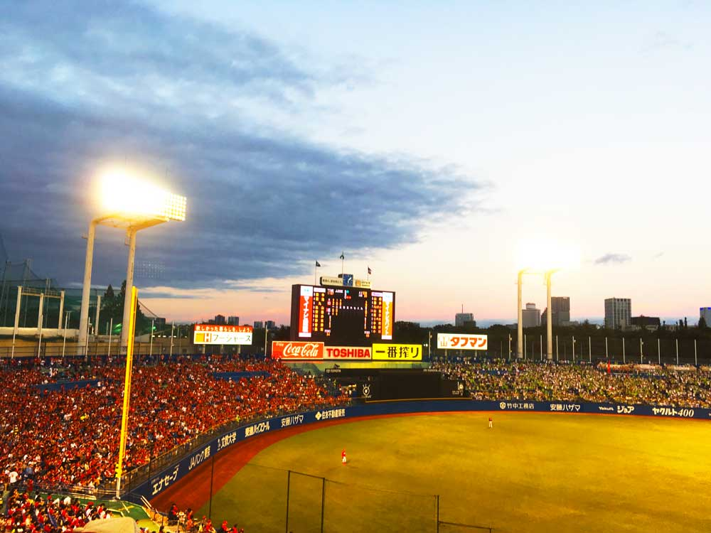  

- - -

### 2017/9/3(日)
#### 公式戦 in 神宮
#### 広島 9 対 ヤクルト 2
この日も一人で参戦。初めての外野A席。背もたれが嬉しい。
試合内容はあまり覚えていないが、カープのボロ勝ちだったんだろう。なんだかヤクルトが不甲斐ないなとも感じた。
2017年の観戦は以上。このあとチケットキャンプが潰れたりとチケット転売が問題視されたのは買う側としては嬉しかった。  
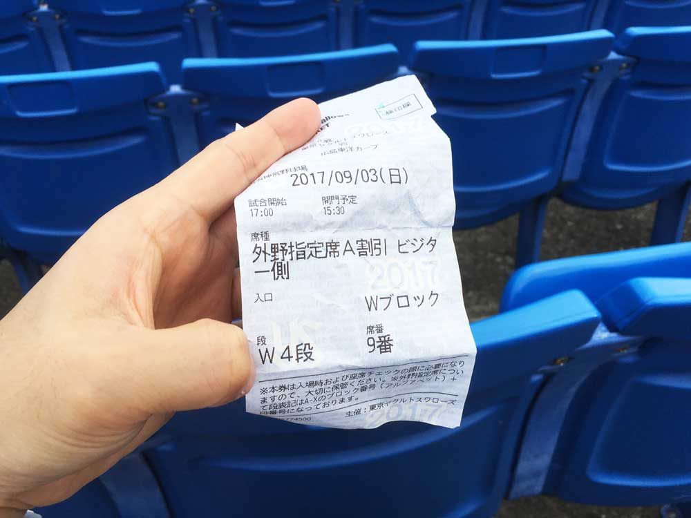  

- - -

## 2018年
### 2018/3/3(土)
#### オープン戦 in 東京ドーム
#### ヤクルト 5 対 巨人 6
この日は友人Kと観戦。オープン戦だと内野席でも1000円とお手軽で嬉しい。
田中広輔の弟の田中俊太が打席にたったのをみたのはこの日が初めてでした。
なかなか良い試合だった。しかし、ヤクルトは本番さながらのスタメンだったので勝って欲しかったですね。
  

- - -

### 2018/3/17(土)
#### オープン戦 in 神宮
#### ヤクルト 7 対 日ハム 6
この日も前回の友人Kと2人で参戦。非常に良い天気だった。
試合内容はあまり覚えていないが、天気の良さだけは鮮明に覚えている。
この後はカープのTwitterでのオフ会に参加。ここがCとの初めての出会いの場でした。  
仕事以外の人と深く話をするのは社会人になって初めてかもしれない。価値観も違う人もいるのでこういう場はそれなりに流すことも覚えないといけないとも思いました。
良い出会いにも恵まれたので、結果は良かったということにしていきたい。
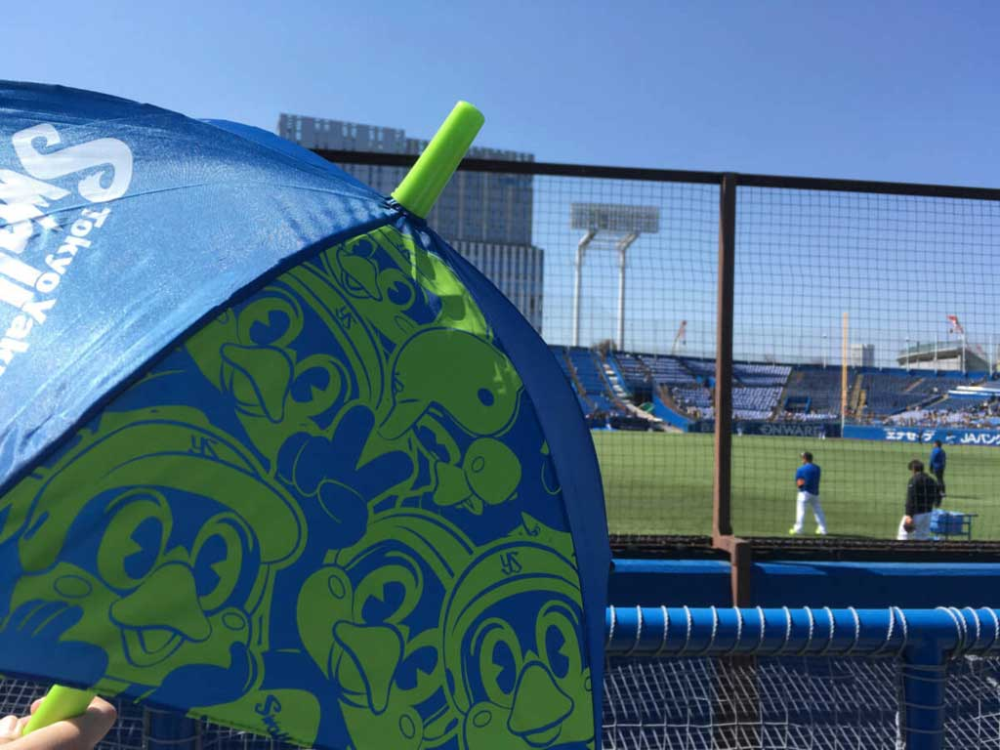  

- - -

### 2018/3/18(日)
#### オープン戦 in 神宮
#### ヤクルト 7 対 ソフトバンク 6
この日も一人で参戦。初めてのバックネット裏。前半はソフトバングが押せ押せだったけど、後半にまさかの逆転。
そしてこの日はヤクルトの出陣式だった。柳田とデスパイネと松田がすごく印象に残った試合だった。
だれか友達と来たかったなと思った試合だった。
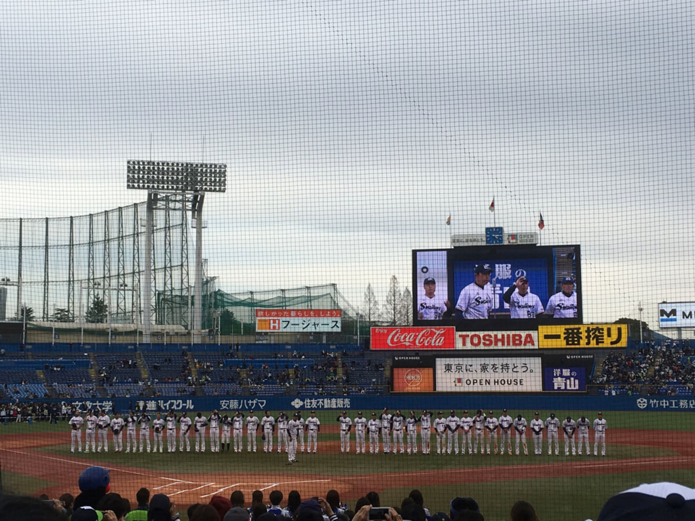  

- - -

### 2018/4/3(火)
#### 公式戦 in 神宮
#### カープ 6 対 ヤクルト 3
この日も一人で参戦。外野の最前列で観戦だったっけな。
カープもヤクルトも春の四球祭りだった。先発は薮田。このあたりから薮田の制球がおかしくなってきたような。。
こんな状態でも負けるヤクルト。何やってるんだか。喝だ！
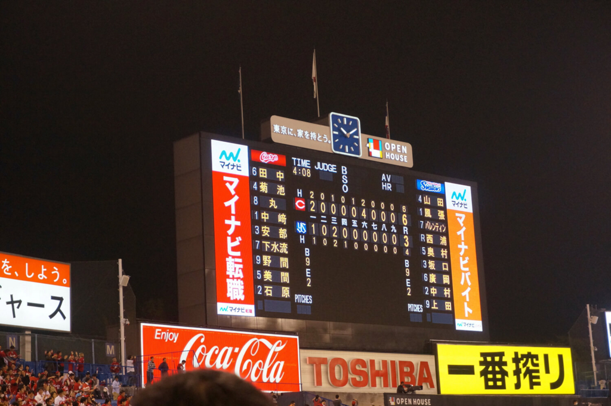  

- - -

### 2018年4月24日(火)
#### 公式戦 in ハマスタ
#### カープの勝ち
好投だった中村祐太が完投まであと１回だったのだが、急に横浜打線に捕まりまさかの降板。
この日完投していれば今季カープの初完投。
本人もそうとう悔しがっていたようで、降板後はベンチで涙する場面も放送されていたようだ。しかし試合終了後のヒーローインタビューでは「泣いてません」と強気の一言。思わず胸が熱くなった。その調子で今季完投を見せて欲しいものだ。
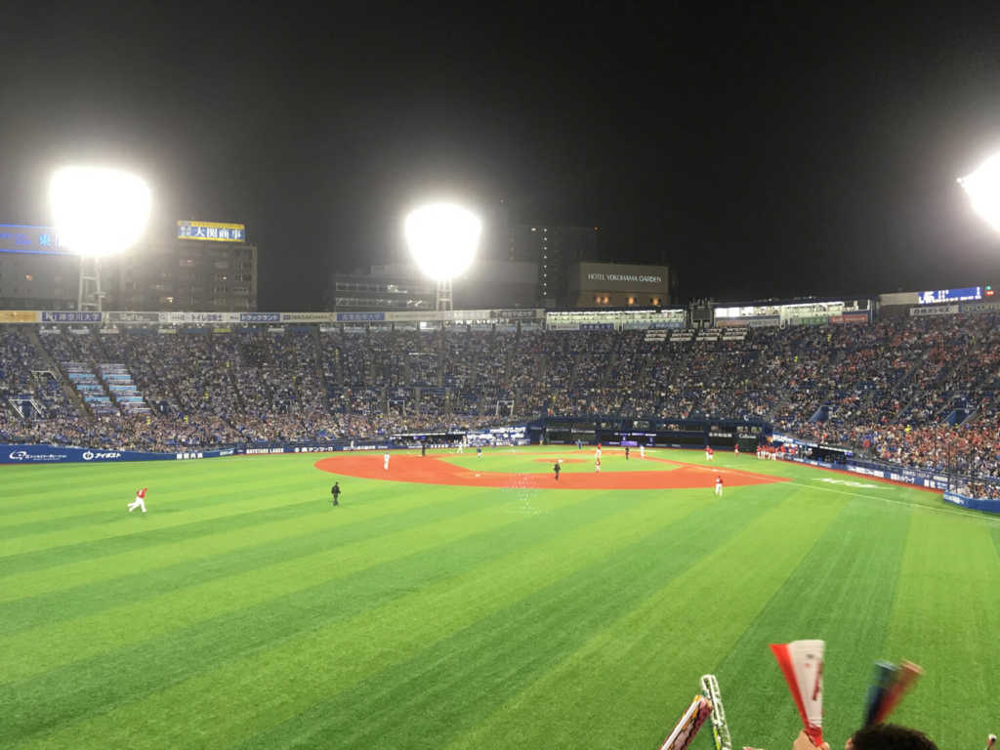  

### 2018年4月26日(木)
#### 公式戦 in ハマスタ
#### カープの勝ち
エルドレッドが9回に山崎康晃から本塁打を放った試合でした。  
これが決勝点となりカープの勝利。外野席にはエルドレッドのお母さんもいた試合でした。  
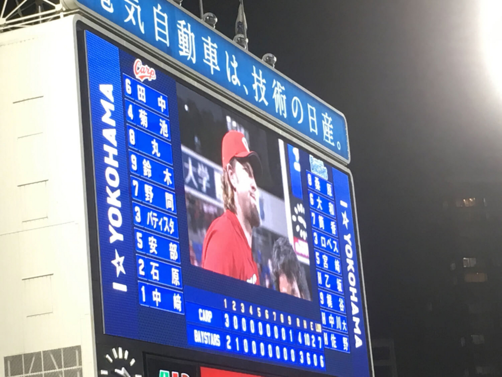  

### 2018年4月28日(土)
#### 公式戦 in ズムスタ
#### カープの勝ち？
広島に帰省した時に見てみました。駅からとにかく遠い！！鈴木誠也がちょうど満塁ホームランを打ったところでした。でも遠すぎるんだよなぁ。  
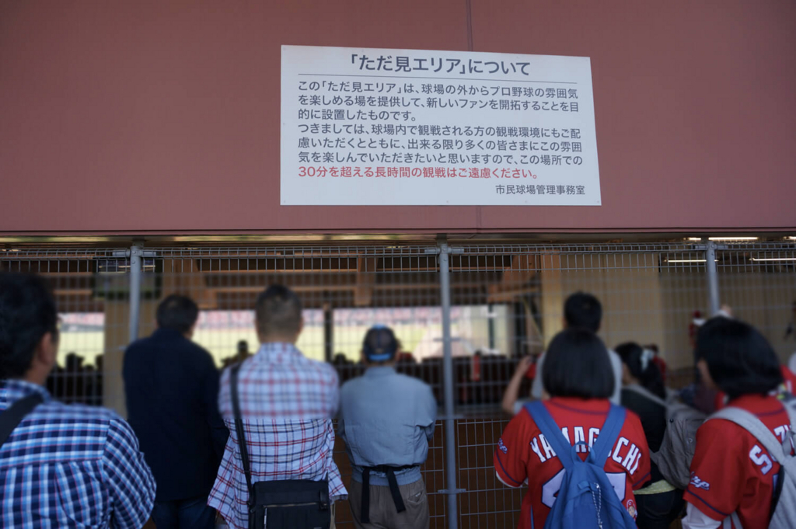 

### 2018/5/4(金)
#### 公式戦 in 神宮
#### カープのボロ負け
この日は友人Kと観戦。ヤクルト先発ブキャナンから1点も取れずに8対0でカープの負け。しかもブキャナンは完封。  
正直なところこの日の試合はまったく打てる気配がなかった。しかも四球すら与えないブキャナンの完璧な投球内容。どの打者もことごとく打ち取られていた。  
そのうえ、夜はかなり冷え込んでしまって、観戦自体が辛くなってくる。こんな試合は初めてだ。
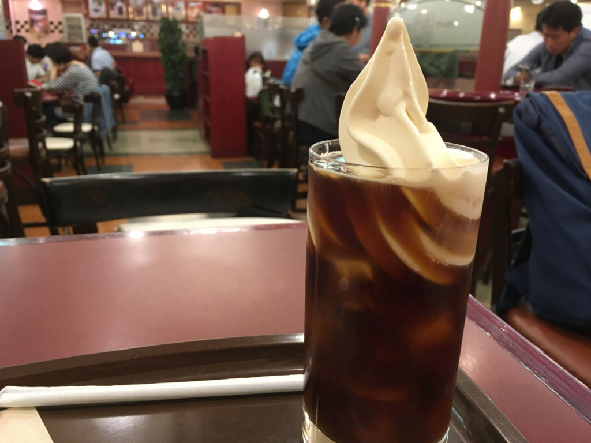  

### 2018/5/5(土)
#### 公式戦 in 神宮
#### カープのボロ勝ち
子どもの日ということで電光掲示板が全てひらがなでした。この日はCとSちゃんと観戦。  
この後飲み会にも行きました。が、いつ帰ったのかが全く記憶にない。  
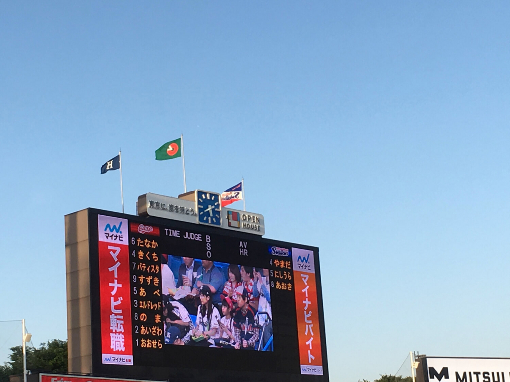 

### 2018/5/6(日)
#### 公式戦 in 神宮
#### カープのサヨナラ負け
TOKIOが事件を起こした翌日に城島が始球式をしていました。  
この日もCと観戦。帰りにバーに行って帰りました。今回のGWはかなり疲れた！
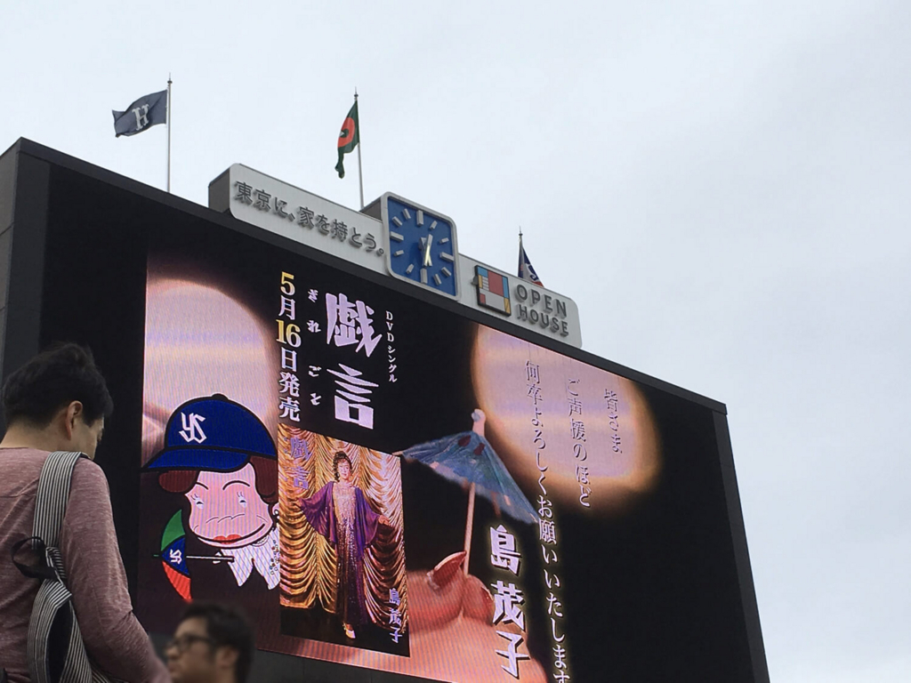  

### 2018/6/2(土)
#### 公式戦 in ZoZoマリンスタジアム
#### カープの負け
めちゃくちゃ遠い、ディズニーランドのはるか先まで行ってきました。  
この日もCと観戦。このひとはずっとスマホをいじってばかりだったのが印象的でした。  
試合はあれよあれよ負けムードに結局負けてしまった。帰りは飲み会があって家に着いたのは夜中だったような。遠いよ！！
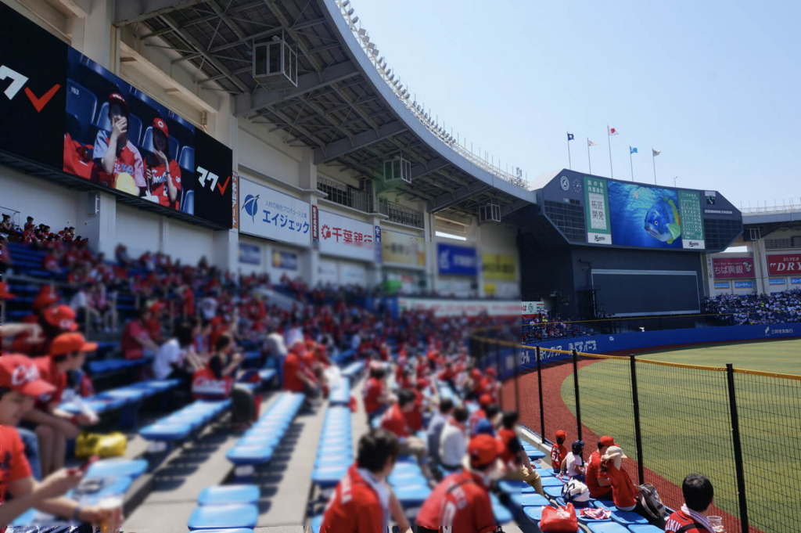  
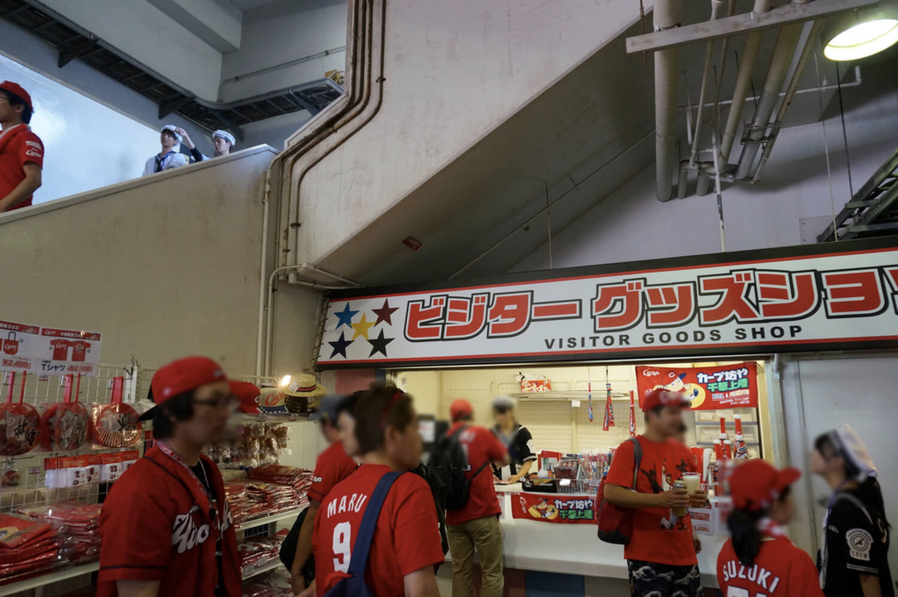  

### 2018/6/29(金)
#### 公式戦 in ハマスタ
#### カープの負け
この日は奥さんと観戦。途中までいい試合だったけど９回最終回、アドゥワが佐野にサヨナラを決められた。がっくり。最近負け試合が多いなぁと思った日でした。  
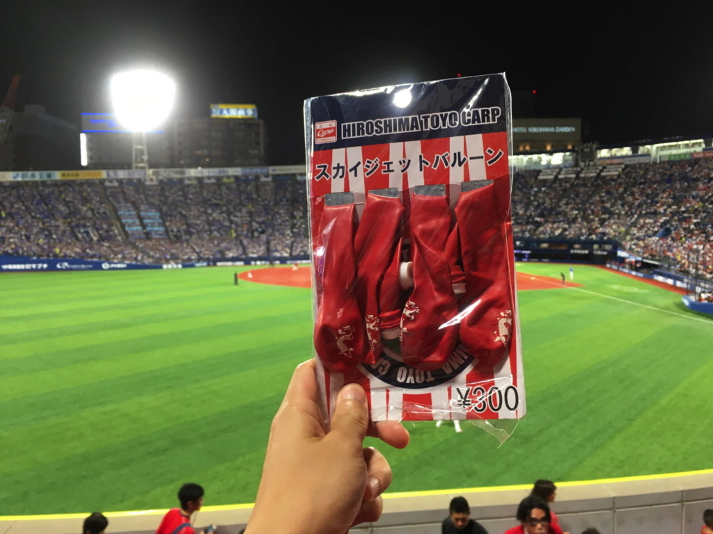  

- - -

## 2019年
### 2019/2/21(木)
#### 練習試合 in 沖縄
#### カープ 0 対 阪神 5
沖縄での阪神ホーム、宜野座村営野球場にて観戦。9割阪神ファン。しかも阪神は応援団まで来てた。沖縄なのに完全アウェイだったなぁ。
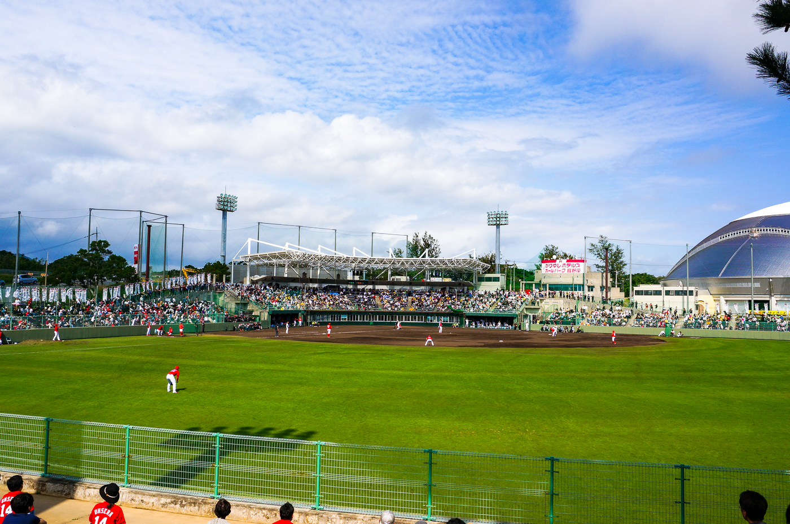  

- - -

### 2019/2/23(土)
#### 練習試合 in 沖縄
#### カープ 5 対 日ハム 9
カープのホーム、コザしんきんスタジアムにて観戦。
日ハムファンも多くて非常によい雰囲気だった。
松山がファンに手を振っていたのが印象的だった。スライリーも来てて、ツーショット写真が撮れたのは良い思い出。
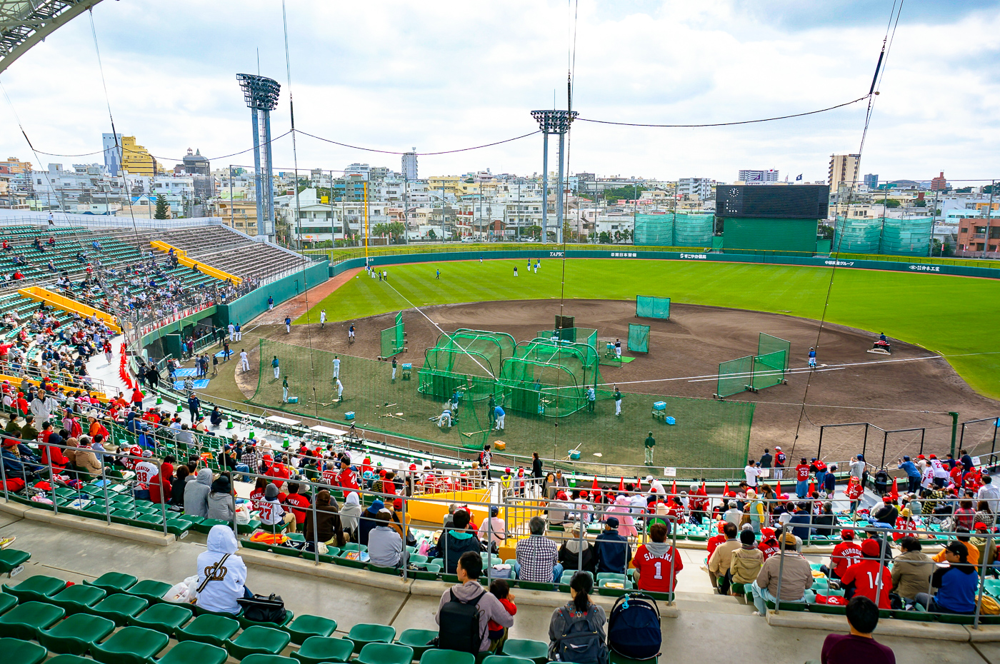  

- - -

### 2019/3/2(土)
#### オープン戦 in 東京ドーム
#### ヤクルト 4 対 巨人 5
この日は一人で観戦。ヤクルト村上の同点2ラン。巨人岡本のサヨナラホームランと見ごたえのある試合だった。遅く行ったので巨人ファンに囲まれての観戦だった。
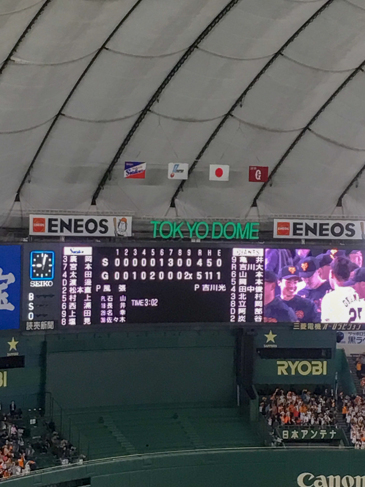  

- - -

### 2019/3/16(土)
#### オープン戦 in 神宮
#### ヤクルト 7 対 巨人 8
この日はO先輩と観戦。今年初めての神宮。ヤクルトが負けそうな雰囲気で、雨も降ってきたのでベローチェへ退避。帰ったあとに、ヤクルトが追い上げるという良い試合だったと気付く。うーん、もったいない。
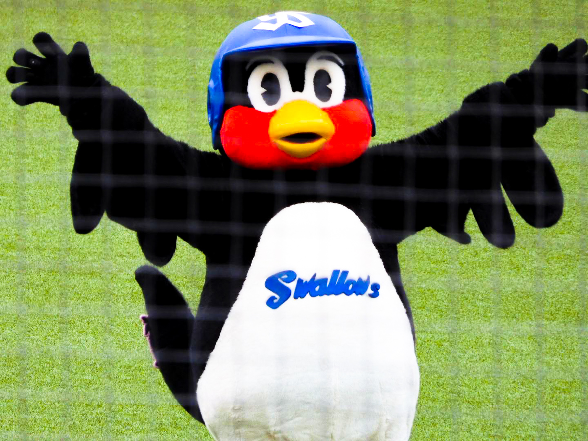  

### 2019/3/21(木)
#### オープン戦 in 神宮
#### カープ 7 対 ヤクルト 7
9回まで3対7とヤクルト優勢だった試合。ところが、小園2ラン、堂林ソロ、バティソロと怒涛の4得点で同点に。やはり神宮では何かが起こる。今年もカープは安泰だと思っていた平和な頃だったなぁ。
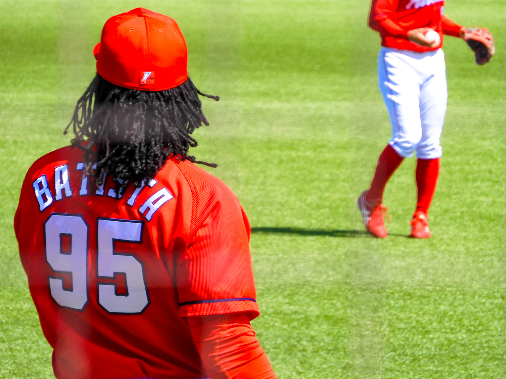 

### 2019/4/6(金)
#### 公式戦 in 神宮
#### ヤクルト 8 対 中日 7
まさかのルーズベルトゲーム。取って取られてのシーソーゲームだった。最後は8回に西浦の逆転タイムリー。ヤクルト打線も中日打線もすごいなと関心してしまった。
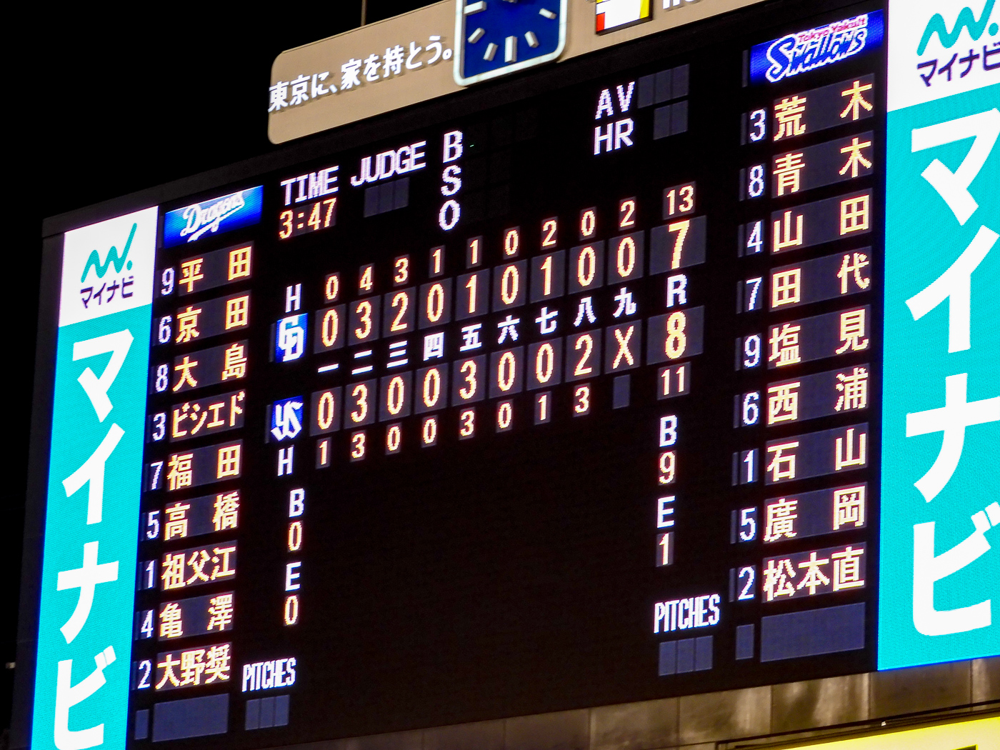 

### 2019/4/6(金)
#### 公式戦 in 神宮
#### ヤクルト 4 対 中日 3
12回まで延長。しかもツーアウトから代打青木がサヨナラホームランでのヤクルトの勝利。しかし、この日は何だか疲れていたので9回で球場を後にした。ヤクルトのストッパー石山がオープン戦から不安定だなと思った。
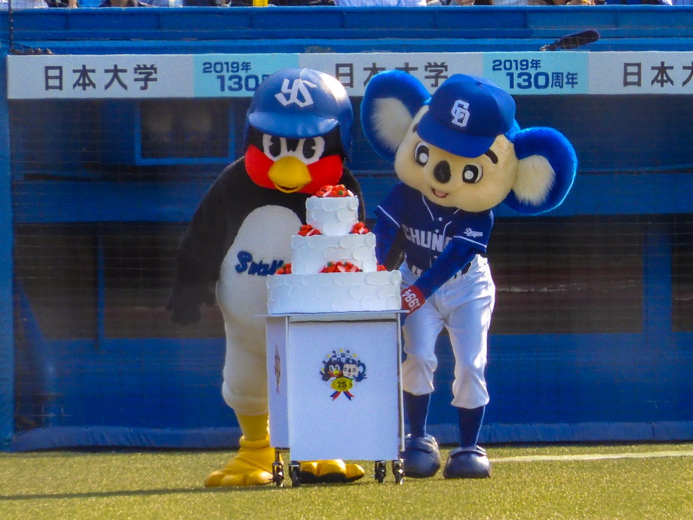  

### 2019/4/13(土)
#### 公式戦 in ハマスタ
#### 広島 6 対 横浜 1
待ちに待ったカープの試合。しかも5連敗中の試合での勝利だったので非常に嬉しかった。カープは先発床田が完投。すごいぞ床田！左腕のエースは今年は床田だ！ちなみに現在4勝11負で単独最下位。どうしたカープ？
写真は、帰りに寄った横浜中華街。デーゲームだと、横浜を楽しめるのでお得感があるな。
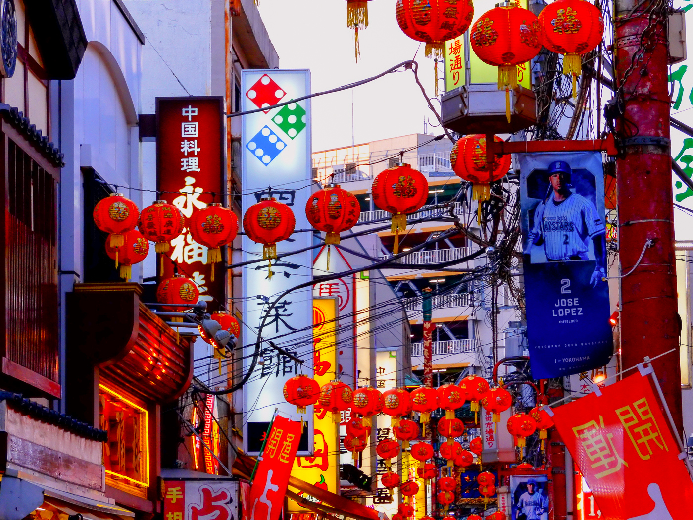 

### 2019/4/27(土)
#### 公式戦 in 神宮
#### 広島 2 対 ヤクルト 0
床田の完封勝利。この日は両親との観戦。カープが今季初めてヤクルトに勝った日。寒い。とにかく寒かった。体感気温は０度くらいじゃなかったのか。家に帰ってから体調が悪化。
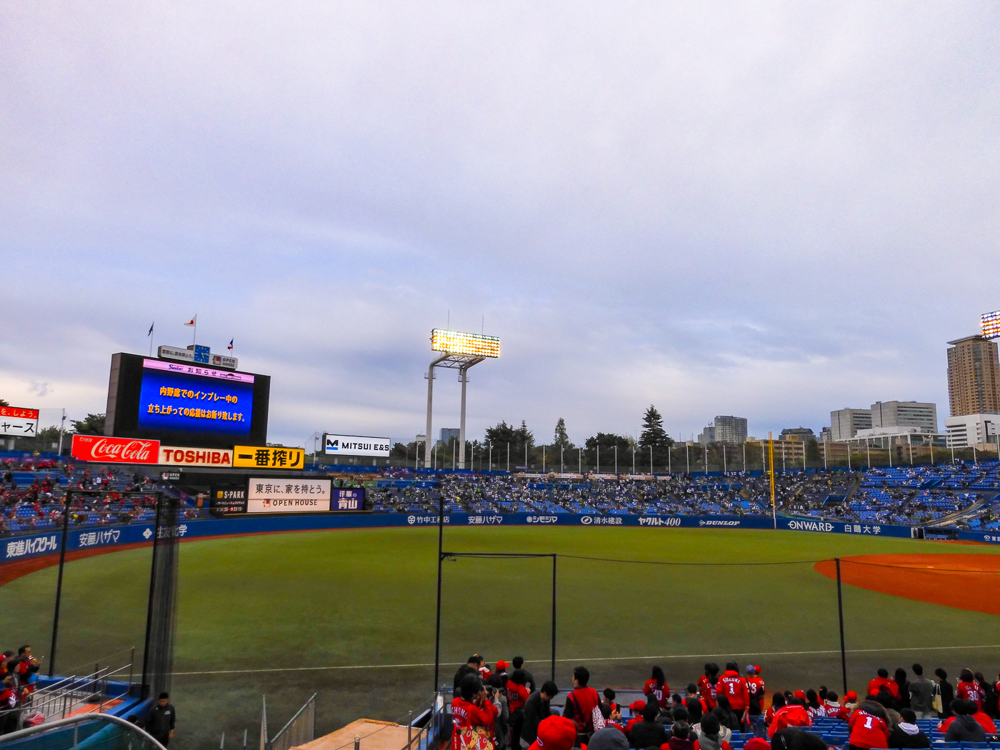 

### 2019/4/29(土)
#### 公式戦 in 神宮
#### 広島 4 対 ヤクルト 7
この日も両親との観戦。GW１０連休の３日目。九里がパッしなかった。しかし最後はバティスタの１発であわや同点というところ場面だったが、いつものように三振。うーん。おしい。九里はこの日から２軍生活へ。
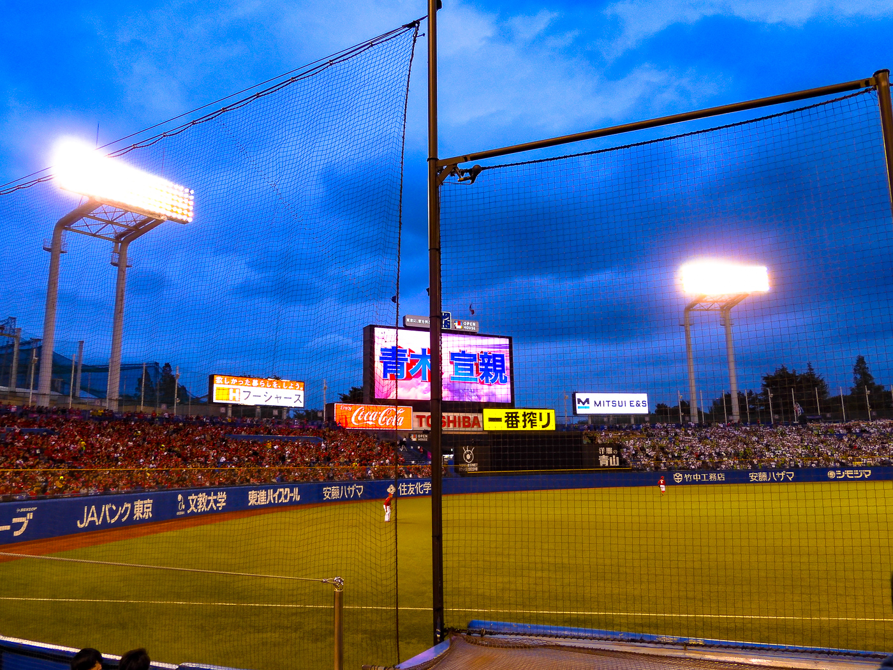 

### 2019/5/4(土)
#### 公式戦 in ナゴド
#### ヤクルト 7 対 中日 2
嫁の実家の名古屋に行ったので人生初のナゴドへ。この日は一人で観戦。中日の応援歌のかっこよいこと。帰りによったイオンも中日一色で広島のイオンみたいで非常によかった。ドアラも好きになった。
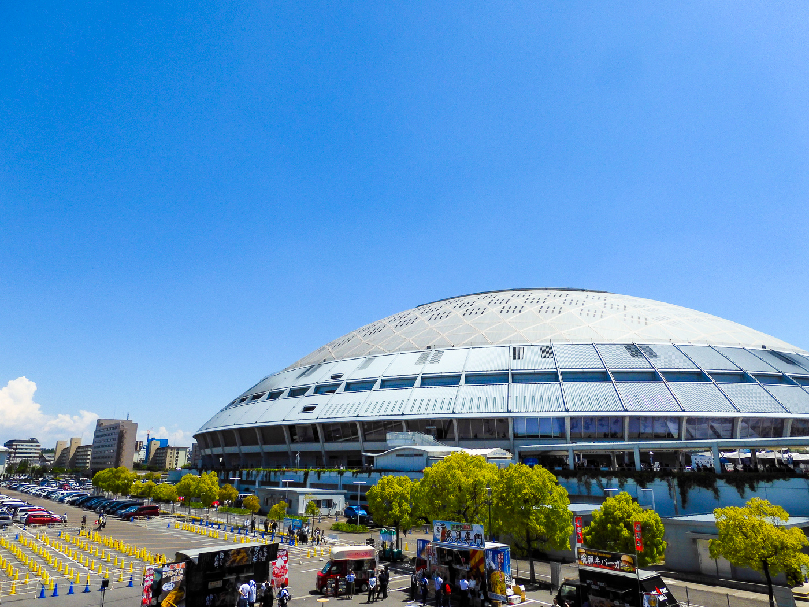 

### 2019/5/5(日)
#### 公式戦 in ナゴド
#### ヤクルト 5 対 中日 6
この日は２人で観戦。正直疲れているのと、せっかくなので中日の勝っているところを見たかったので、ヤクルト外野席にいながらも心の底では中日を応援していた。地元中日の応援は非常に良い。爽やかでかっこいい。次はカープ戦で来たいものだ。
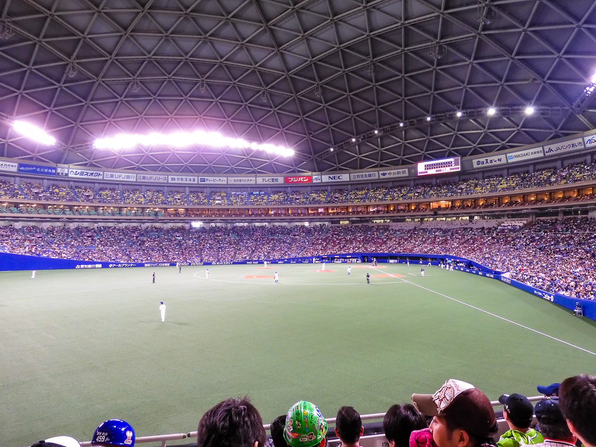 

### 2019/5/18(土)
#### 公式戦 in 神宮
#### ヤクルト 6 対 横浜 11
この日は1人で観戦。ビジターでも絶好調な横浜打線が止まらない。それでも6点返したヤクルトはすごい。この辺りから少しだけ観戦疲れが。一人でくると疲れも早くくるなぁと思った。
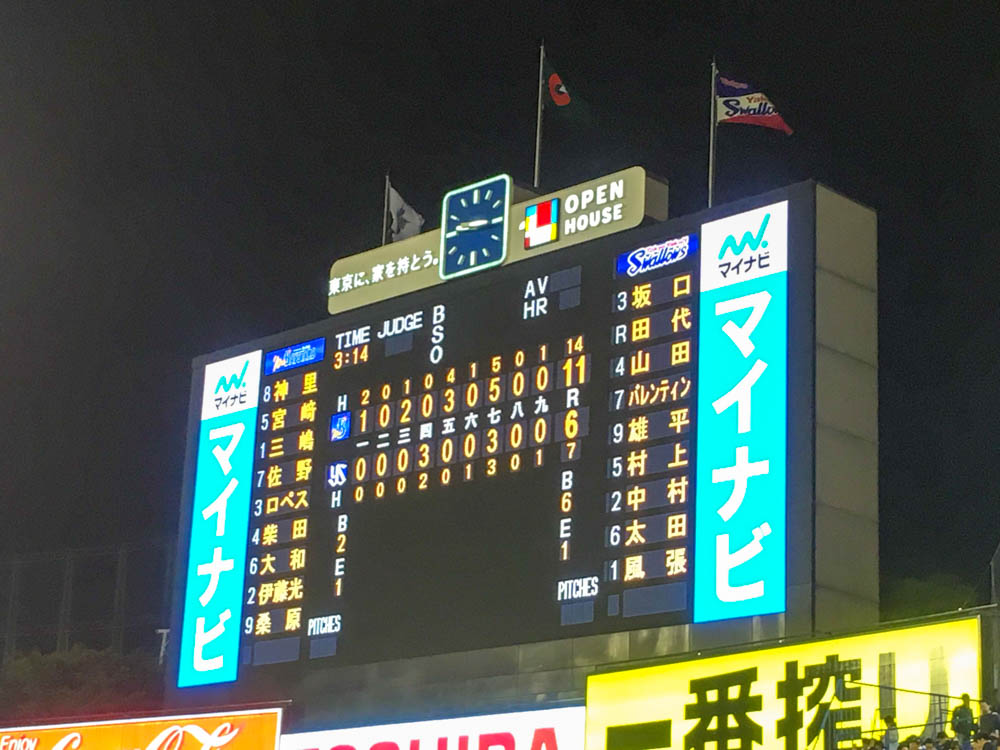 

### 2019/5/28(火)
#### 公式戦 in 神宮
#### 広島 8 対 ヤクルト 7
仕事を30分早退して観戦。この日は一人。初めての最前列だった。ヤクルトは絶賛10連敗中で、さすがにこの日はカープは負けるかと思っていたのだがいつもの通りに勝ってくれた。でも内容はヤクルトの終盤の追い上げを見ていると、ヤクルトが勝てた試合じゃなかったのかと思えてくる内容だった。
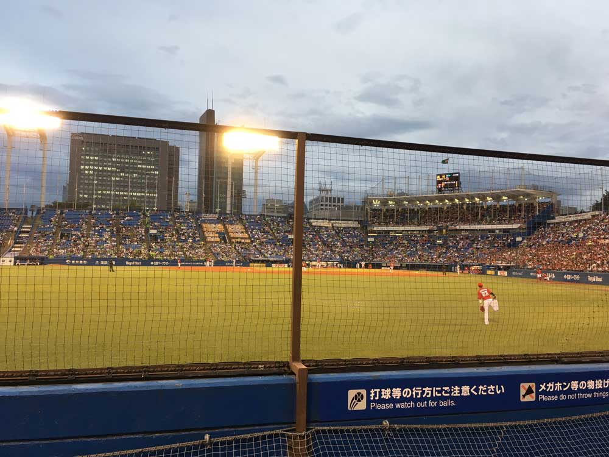 

### 2019/5/30(木)
#### 公式戦 in 神宮
#### 広島 13 対 ヤクルト 0
この日も仕事を30分早退して観戦。この日も一人。内容はカープのボロ勝ち。この日は隣で観戦していたサラリーマン風の人3人と仲良くなった。次会うことはあるのだろうか。今までもこういうことはあったが、2回目に会うことは無かった。今回もこれっきりの出会いなのだろう。これも野球の醍醐味。
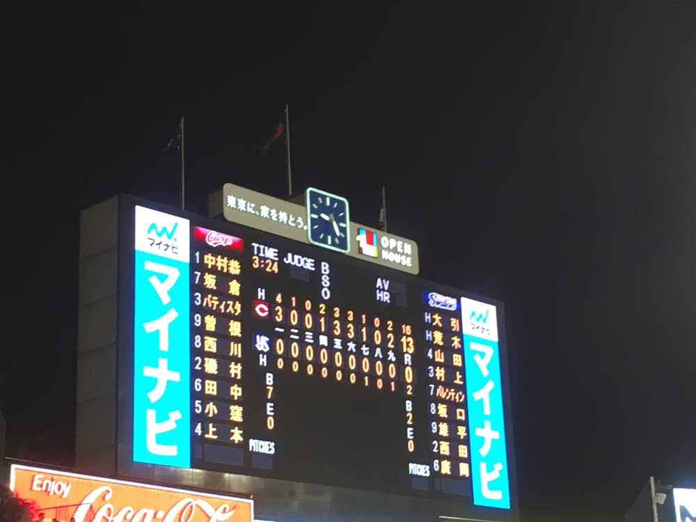 

### 2019/6/8(土)
#### 公式戦 in 神宮
#### ヤクルト 4 対 オリックス 5
予報だったが真夏日並の暑さ。かなり焼けた。真夏の観戦のようだったけど、2人で観戦するもはやはり楽しい。オリックスの応援もかっこよくて良い。次回はカープ戦に行こうと約束。楽しみが増えた。
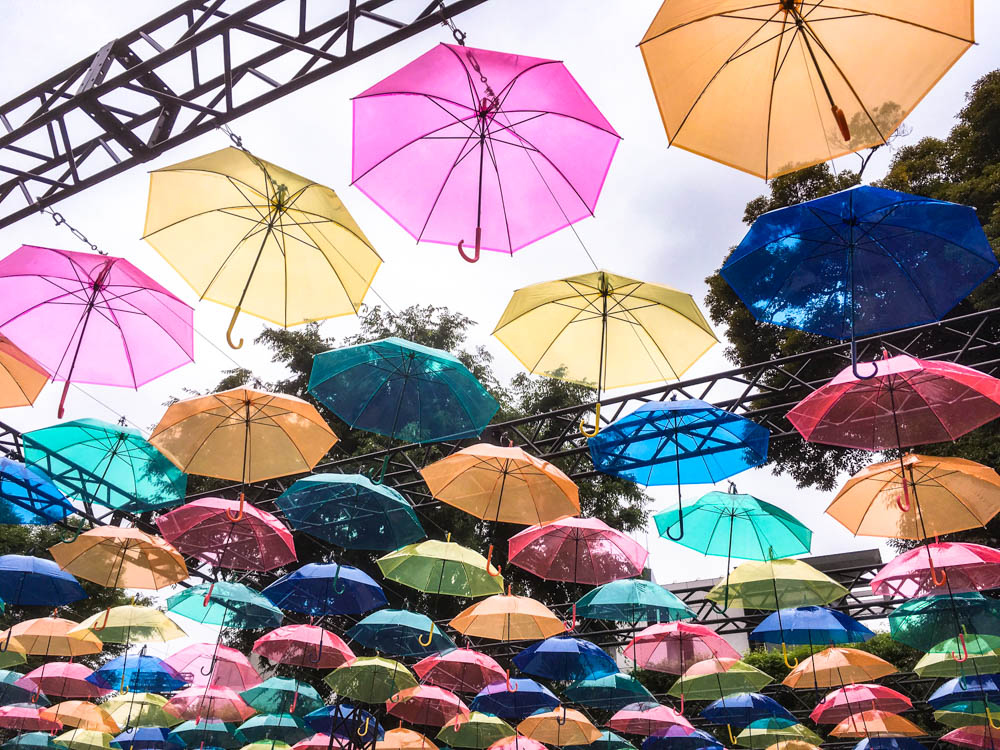 

### 2019/6/29(土)
#### 公式戦 in 横浜
#### カープ 1 対 横浜 2
この日は夫婦2人で観戦。守り切ることができなかったカープのサヨナラ負け。怒涛の連敗は止まらない。そして横浜まで日帰りというのが何気にきつくなってきた。来年からは1泊したいものだ。
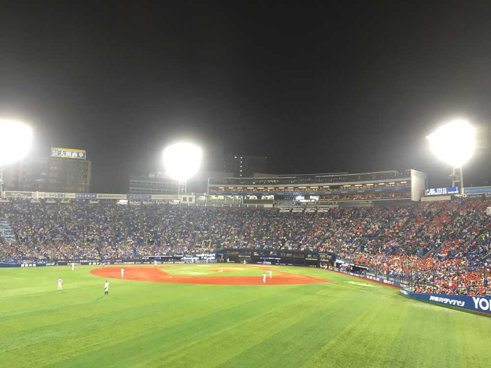 

### 2019/7/26(金)
#### 公式戦 in 神宮
#### 広島 12 対 ヤクルト 3
この日は仕事を1時間ほど早退して観戦。ネットで知り合った人たちとの観戦。途中で大雨になったので8回裏で帰宅。彼らは最後まで観戦したみたいだ。ヤクルトの若手(蔵元、久保)中継ぎ陣が打たれまくって、少し可哀相に思えてきた。
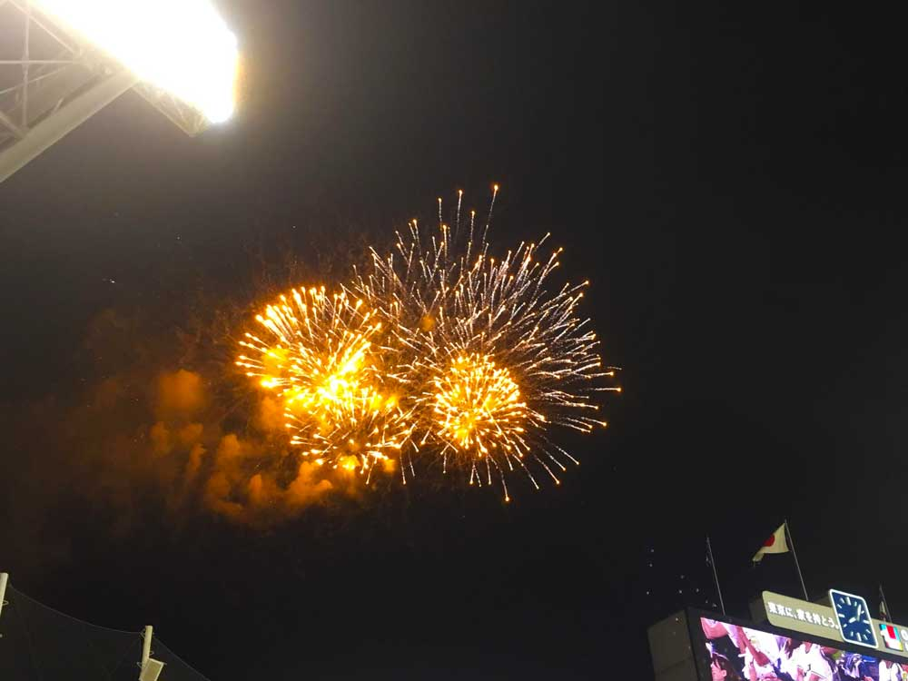 

### 2019/7/27(土)
#### 公式戦 in 神宮
#### 広島 3 対 ヤクルト 2
この日は前の会社の人達と観戦。雨が降るかと思ったが天気に恵まれた。みんなで食事を楽しんだりしたのでチャンスの場面を見逃したりはしたけれど、最後まで楽しく観戦することができた良い1日だった。次回はバスケットボール観戦をしようと盛り上がった。
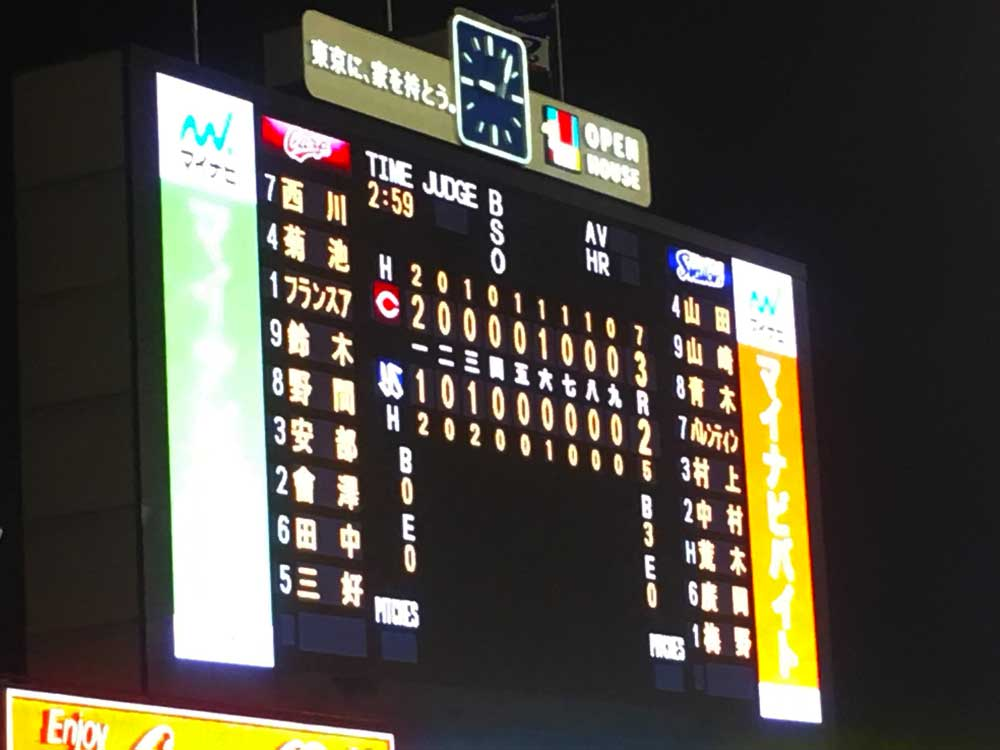 

### 2019/7/28(日)
#### 公式戦 in 神宮
#### 広島 12 対 ヤクルト 5
この日は妻と観戦。天気には恵まれた。相変わらずのカープのボロ勝ち。ヤクルトの投手が気の毒になる。
ヤクルトの中継ぎは若手の蔵元と久保。ボコボコに打たれまくっていたが、いつの日か糧にしてほしいと相手チームながらに思った。
神宮ではやはりソーセージがうまい！
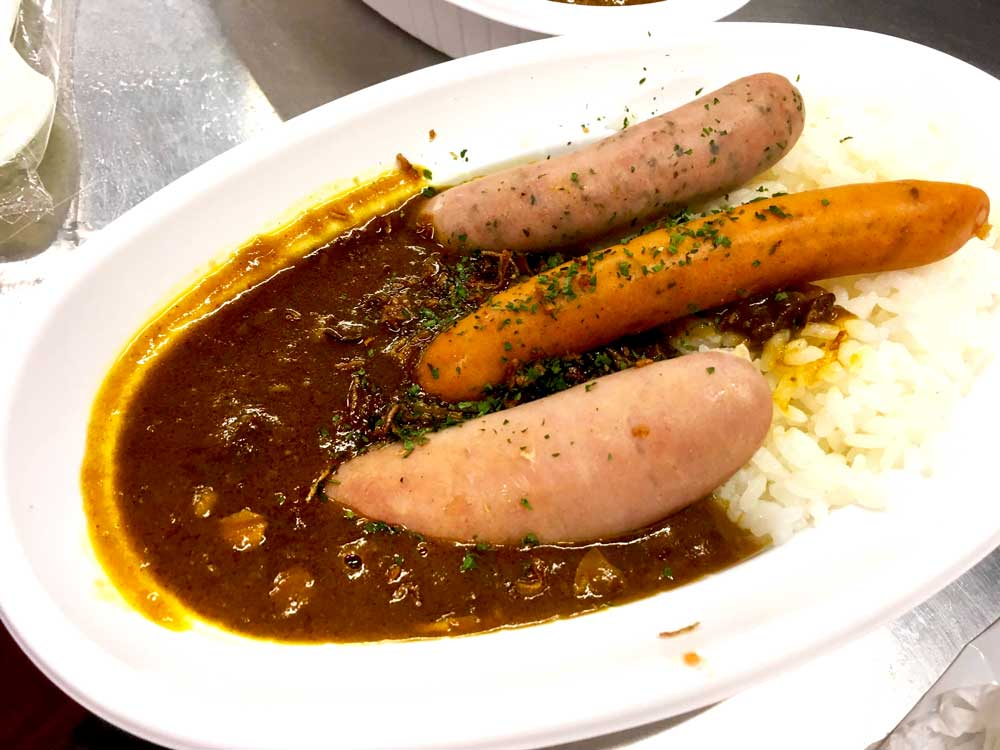 

### 2019/8/17(土)
#### 公式戦 in 横浜
#### カープ 3 対 横浜 8
この日は1人で観戦。行きの電車では座れず各停に乗ったり、試合も散々だったり、客席では外国人客がはしゃいで周りの客がキレたり、
なんだか散々な1日だった。
ハマスタは行き帰りにかなり時間がかかるし、チケットも高い。来年からはファンクラブへ入るのをやめようと決意。多分現地観戦はしないだろう。
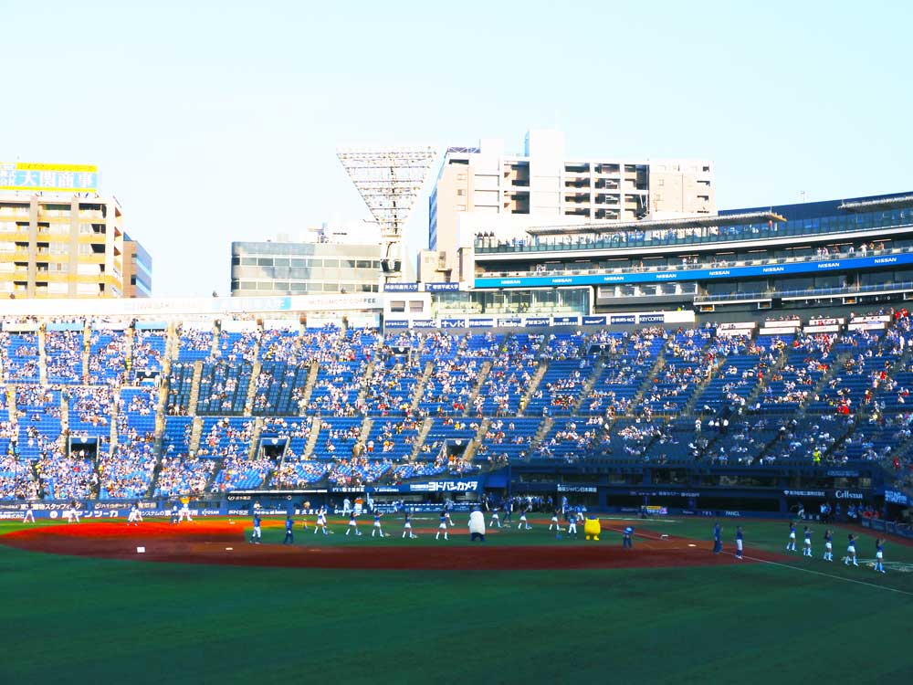 

### 2019/9/3(火)
#### 公式戦 in 神宮
#### 広島 3 対 ヤクルト 0
この日はいつもヤクルト観戦をする先輩と一緒に観戦。
先輩は神宮ビジターでの観戦は初めてとのこと。楽しんでもらえただろうか。
カープの選手やスライリーを紹介しながらの観戦だったので、試合内容があまり頭に入ってこなかった。
それでもこの日は何と石原にソロホームランが出た。これには周りのお客さんも大興奮。
やはり誰かと一緒に観戦するのは楽しい！
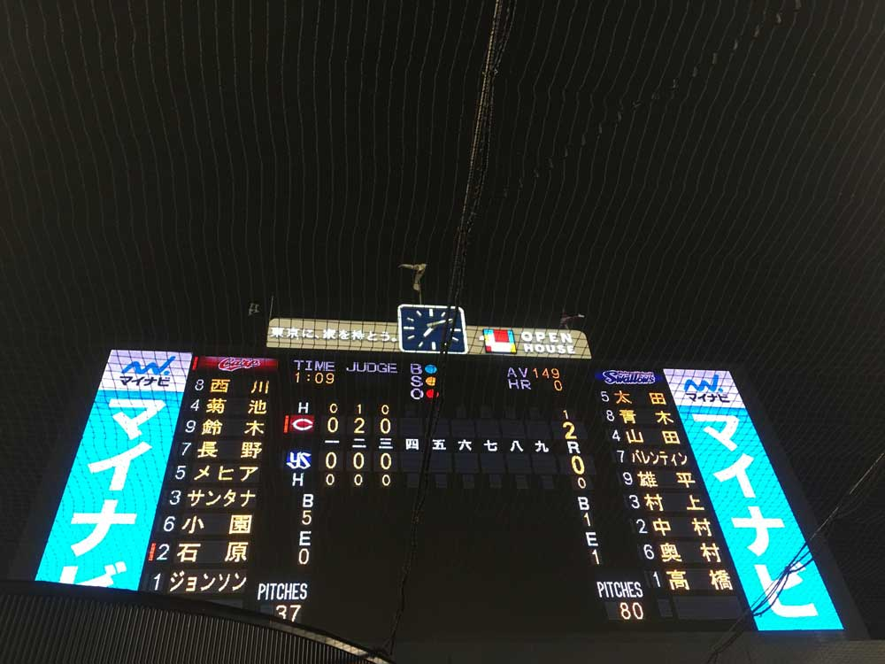 

### 2019/9/5(木)
#### 公式戦 in 神宮
#### 広島 8 対 ヤクルト 1
この日は妻と観戦。今年最後の観戦だ。
試合展開は後半からいつものカープで点を取りまくってくれた。
隣の席になった大学生と仲良くなったり、三好の新しい応援スタイルがあったりと最後を締めくくるにはふさわしい試合だった。
おまけに雨ばかりの神宮がこの日はカラリと晴れてくれた。
今年一番の試合だった。
また来年も来よう。時にはつまらない試合もあったが、やはりカープが一番！毎回こういう試合がみたい。
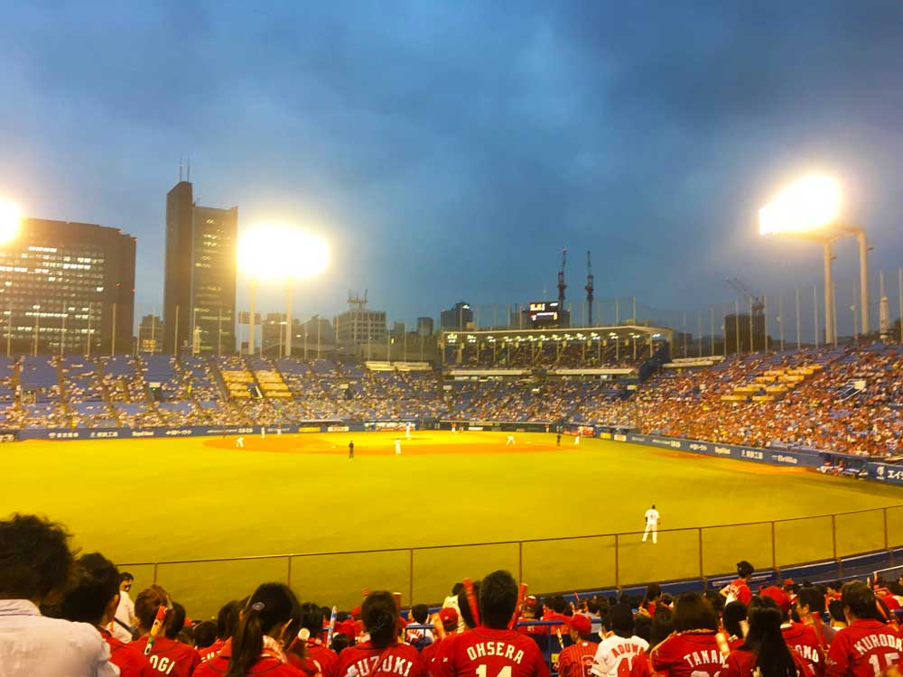 