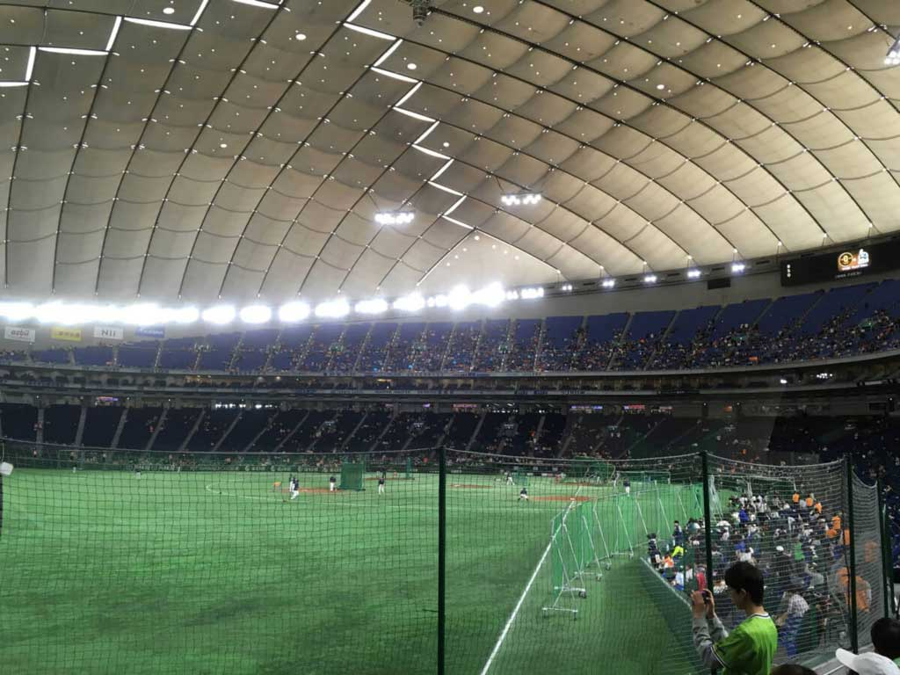

今まで行ってきた野球観戦をまとめています。

<!--more-->

- - - 

## 2017年
### 2017年7月7日 (金)
#### 公式戦 in 神宮
#### 広島 9 対 ヤクルト 8
記念すべき初めての神宮観戦。最後はまさかの9回裏新井の逆転ホームラン。七夕の季節になると今でも思い出す試合です。
友人Kと行った試合です。とてもよかった！！
  

- - -

### 2017年7月9日 (日)
#### オープン戦 in 神宮
#### 広島 3 対 ヤクルト 3
この日は奥さんと観戦。９回までカープが負けていたが新井のタイムリーで同点へ。そのまま逆転かと思ったが結局は引き分けだった。
この日は自由席だったため２時間前から並んだ。延長戦は少ししんどかったな。
  

- - -

### 2017年9月2日 (土)
#### 公式戦 in 神宮
#### 広島 3 対 ヤクルト 1
この日は一人で参戦。今はなきチケットキャンプでチケットを購入。初めての内野席だった。
隣のオヤジがうるさいし、席を変わって欲しいと頼まれたりで良い席ではなかった(変わった直後に後ろのオヤジの野次がひどいので再度代わってもらった。席の交換はこりごりだ。)。
内野席の後ろの方は音楽がうるさいなと思った。
ただ、内野席から見る外野はキレイだった。半分が赤、半分が緑でよいバランスだったな。
  

- - -

### 2017/9/3(日)
#### 公式戦 in 神宮
#### 広島 9 対 ヤクルト 2
この日も一人で参戦。初めての外野A席。背もたれが嬉しい。
試合内容はあまり覚えていないが、カープのボロ勝ちだったんだろう。なんだかヤクルトが不甲斐ないなとも感じた。
2017年の観戦は以上。このあとチケットキャンプが潰れたりとチケット転売が問題視されたのは買う側としては嬉しかった。  
  

- - -

## 2018年
### 2018/3/3(土)
#### オープン戦 in 東京ドーム
#### ヤクルト 5 対 巨人 6
この日は友人Kと観戦。オープン戦だと内野席でも1000円とお手軽で嬉しい。
田中広輔の弟の田中俊太が打席にたったのをみたのはこの日が初めてでした。
なかなか良い試合だった。しかし、ヤクルトは本番さながらのスタメンだったので勝って欲しかったですね。
  

- - -

### 2018/3/17(土)
#### オープン戦 in 神宮
#### ヤクルト 7 対 日ハム 6
この日も前回の友人Kと2人で参戦。非常に良い天気だった。
試合内容はあまり覚えていないが、天気の良さだけは鮮明に覚えている。
この後はカープのTwitterでのオフ会に参加。ここがCとの初めての出会いの場でした。  
仕事以外の人と深く話をするのは社会人になって初めてかもしれない。価値観も違う人もいるのでこういう場はそれなりに流すことも覚えないといけないとも思いました。
良い出会いにも恵まれたので、結果は良かったということにしていきたい。
  

- - -

### 2018/3/18(日)
#### オープン戦 in 神宮
#### ヤクルト 7 対 ソフトバンク 6
この日も一人で参戦。初めてのバックネット裏。前半はソフトバングが押せ押せだったけど、後半にまさかの逆転。
そしてこの日はヤクルトの出陣式だった。柳田とデスパイネと松田がすごく印象に残った試合だった。
だれか友達と来たかったなと思った試合だった。
  

- - -

### 2018/4/3(火)
#### 公式戦 in 神宮
#### カープ 6 対 ヤクルト 3
この日も一人で参戦。外野の最前列で観戦だったっけな。
カープもヤクルトも春の四球祭りだった。先発は薮田。このあたりから薮田の制球がおかしくなってきたような。。
こんな状態でも負けるヤクルト。何やってるんだか。喝だ！
  

- - -

## 2019年
### 2019/2/21(木)
#### 練習試合 in 沖縄
#### カープ 0 対 阪神 5
沖縄での阪神ホーム、宜野座村営野球場にて観戦。9割阪神ファン。しかも阪神は応援団まで来てた。沖縄なのに完全アウェイだったなぁ。
  

- - -

### 2019/2/23(土)
#### 練習試合 in 沖縄
#### カープ 5 対 日ハム 9
カープのホーム、コザしんきんスタジアムにて観戦。
日ハムファンも多くて非常によい雰囲気だった。
松山がファンに手を振っていたのが印象的だった。スライリーも来てて、ツーショット写真が撮れたのは良い思い出。
  

- - -

### 2019/3/2(土)
#### オープン戦 in 東京ドーム
#### ヤクルト 4 対 巨人 5
この日は一人で観戦。ヤクルト村上の同点2ラン。巨人岡本のサヨナラホームランと見ごたえのある試合だった。遅く行ったので巨人ファンに囲まれての観戦だった。
  

- - -

### 2019/3/16(土)
#### オープン戦 in 神宮
#### ヤクルト 7 対 巨人 8
この日はO先輩と観戦。今年初めての神宮。ヤクルトが負けそうな雰囲気で、雨も降ってきたのでベローチェへ退避。帰ったあとに、ヤクルトが追い上げるという良い試合だったと気付く。うーん、もったいない。
  