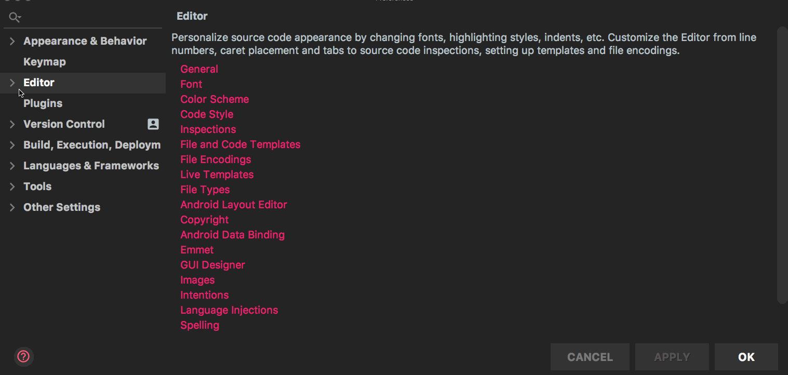
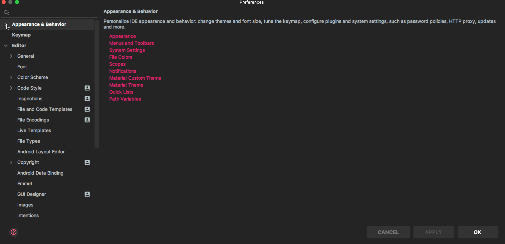
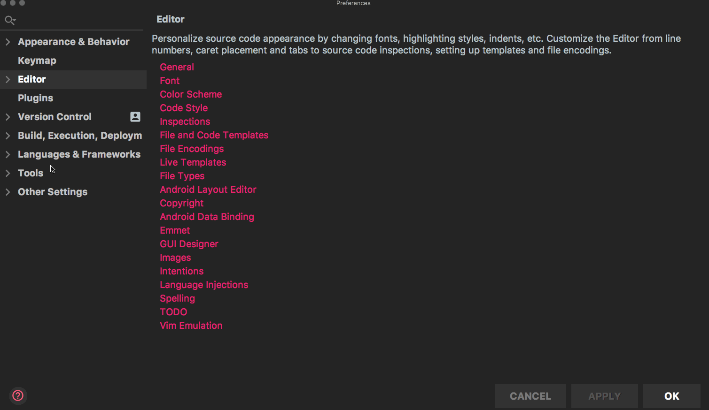

IntelliJでこれだけはインストール時にやっておいたほうが良いと思っている設定です。  
<!--more-->

## スペースを表示させる
エディタ内のスペースを表示させる設定です。  
`
preference > Editor > General > Appearance > ON ‘Show whitespaces’
`
  

## エディタ内の縦線を消す方法
まずエディタ内の縦線とは何かといいますと、右側にあるこいつです。  
  

上記の縦線を消す設定はこちらです。
`
preference > Editor > General > Appearance > OFF ‘Show hard wrap guide’
`
  

## エディタの文字サイズを変更する方法
`
preference > Editor > Font
`
  

## エディタ全体の文字サイズを変更する方法
`
preference > Editor > Font
`
  

## タブをスペースに変換する方法
`
preference > Editor > Code Style> Java > OFF ‘Use Tab character’
`

個人的にはスペース4つではなく、以下の設定でスペース2つにすることをおすすめします。
`
preference > Editor > Code Style> Java > ‘Indent 2’
`
  

