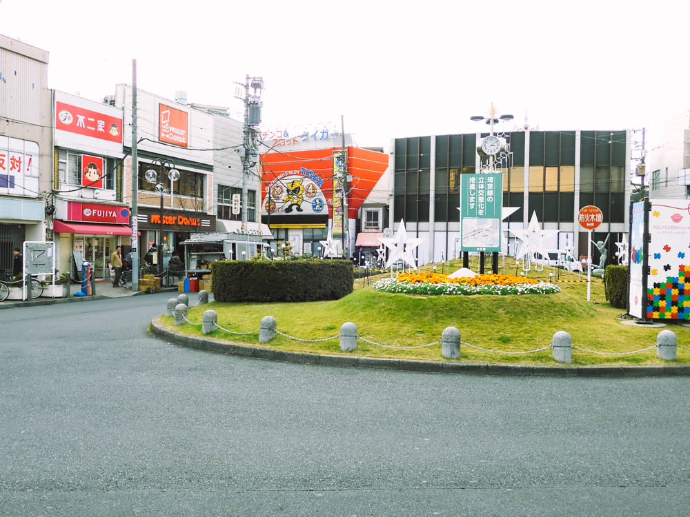
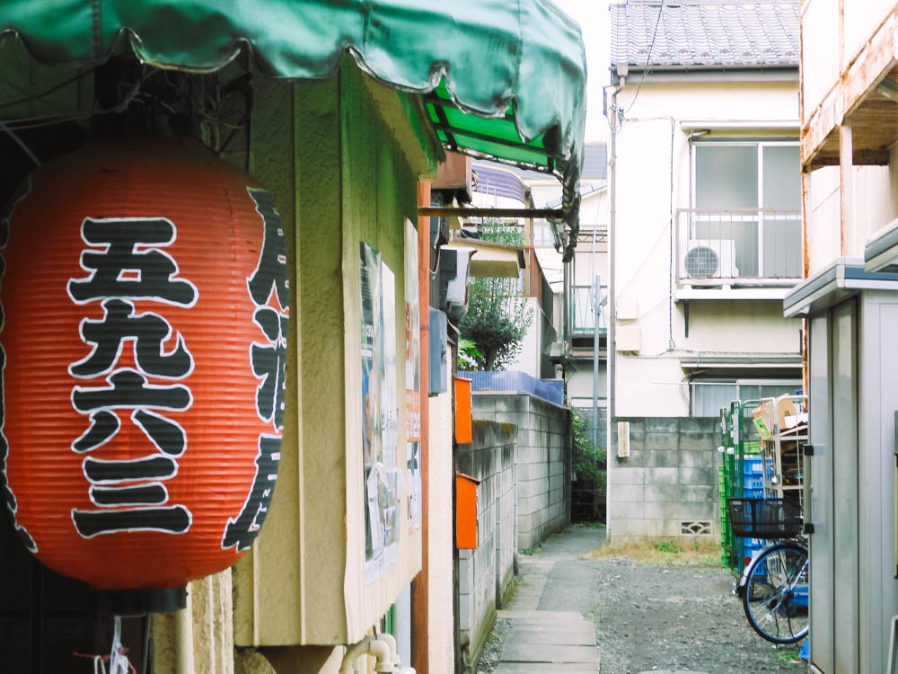
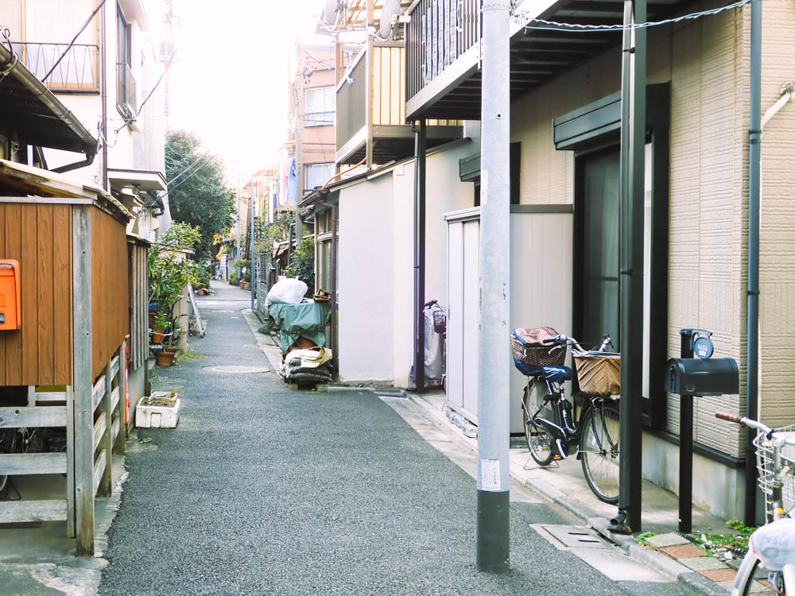
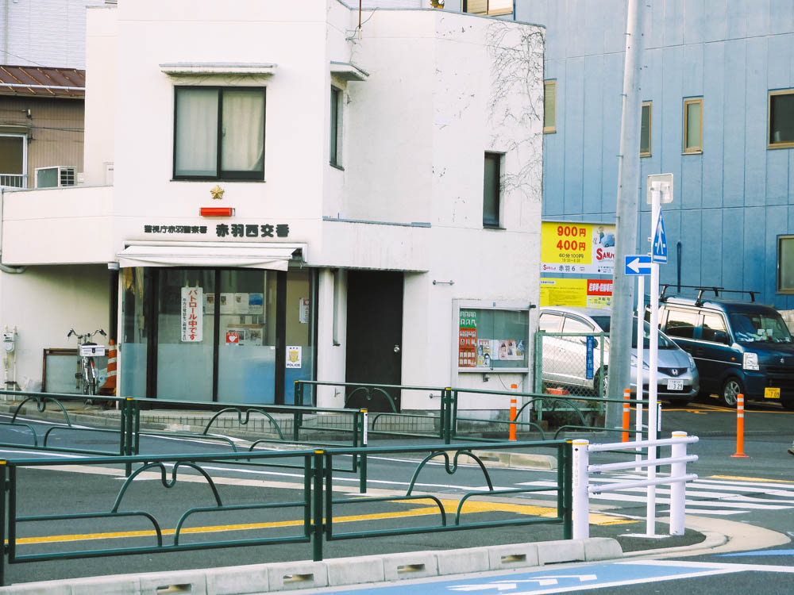

十条から赤羽を散策してきました。  

<!--more-->
2020年1月の中旬くらいに十条から赤羽を散策してきた。  
Google Mapで調べたら2Kmだったが意外と距離があるんだな。
想像通りにレトロな看板が目立つ街で、「野良フォント」を撮ろうと試みたが途中でやめてしまった。
何だか中途半端な写真になりそうだったし。  
歩いていてもほのぼのとする良い街並。笹塚とかあのあたりに似ている雰囲気かな。じゃあ笹塚を歩けよって思うけど若干違うんだな。
このあたりの街並はやはり好きだ。上京してきたことをよく思い出す。  
そして赤羽で初めてタピオカを食べたのもよい思い出。  

